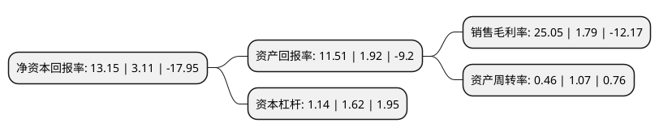

> 本页面由自动化程序生成于 2022年5月20日 01:38
> 内容可能存在错误，如有bug请提交issue至：https://github.com/Eroleice/doc-pi/issues
{.is-warning}

# 上市公司基本情况

## 基本资料

东芯半导体股份有限公司（以下简称“东芯股份”）成立于2014年11月26日，上海市。于2021年12月10日在上交所科创板上市。

东芯股份注册资本44,224.976万元，主要产品:24nm NAND，48nm NOR，业务:提供NAND，NOR，DRAM等存储芯片完整解决方案，并能为优质客户提供芯片定制开发服务。以下是详细信息：

- 公司名称: 东芯半导体股份有限公司
- 股票代码: 688110.SH
- 所在地: 上海 - 上海市
- 成立日期: 2014年11月26日
- 注册资本: 44,224.976万元
- 法定代表人: 蒋学明
- 主营业务: 主要产品:24nm NAND，48nm NOR，业务:提供NAND，NOR，DRAM等存储芯片完整解决方案，并能为优质客户提供芯片定制开发服务
- 公司官网: www.dosilicon.com
- 公司介绍: 公司是中国大陆领先的存储芯片设计公司，聚焦中小容量通用型存储芯片的研发、设计和销售，是中国大陆少数可以同时提供NAND、NOR、DRAM等存储芯片完整解决方案的公司，并能为优质客户提供芯片定制开发服务。公司研发团队通过多年在存储芯片设计领域积累的大量技术经验，基于自有知识产权和研发设计体系，自主开发了NAND、NOR、DRAM等主流存储芯片，凭借高可靠性、低功耗等特点，多款代表公司先进技术水平的核心产品通过国内外多家知名企业的认证。公司拥有多项国内外发明专利，多项集成电路专业布图设计所有权，先后获得“第七届中国电子信息博览会创新奖”、“2020年度中国IC设计成就奖之年度最佳存储器”、“2019年度上海市‘专精特新’中小企业”等荣誉称号。

## 股东及高管情况

上市公司第一大股东为东方恒信资本控股集团有限公司，持股143,213,025股，占比32.38%，为上市公司实际控制人。

截至2022年03月31日，上市公司的前十大股东中，共有2名自然人股东，7名机构股东，1个产品账户，其中5%以上大股东共有4名。上市公司前十大股东明细如下：

> 截至2022年03月31日，上市公司前十大股东信息如下：

| 股东名称 | 持股数量（股） | 持股比例 |
| --- | --- | --- |
| 东方恒信资本控股集团有限公司 | 143,213,025 | 32.38% |
| 上海聚源聚芯集成电路产业股权投资基金中心(有限合伙) | 28,070,175 | 6.35% |
| 齐亮 | 28,070,175 | 6.35% |
| 苏州东芯科创股权投资合伙企业(有限合伙) | 22,500,000 | 5.09% |
| 杭州中金锋泰股权投资合伙企业(有限合伙) | 19,478,096 | 4.4% |
| 哈勃科技投资有限公司 | 13,267,493 | 3% |
| 杭州时代鼎丰创业投资合伙企业(有限合伙) | 10,526,316 | 2.38% |
| 深圳市前海鹏晨源拓投资企业(有限合伙) | 8,771,930 | 1.98% |
| 董玮 | 8,771,930 | 1.98% |
| 上海小橡创业投资合伙企业(有限合伙) | 7,017,544 | 1.59% |

## 利润表分析

上市公司2021年总收入为11.34亿元，净利润为2.84亿元，实现盈利。

## 杜邦分析

> 数据列示周期：2021年 | 2020年 | 2019年
{.is-info}

上市公司的净资产收益率在近一年有所上升，上升幅度为322.83%，其变化情况分解如下：
- 上市公司的销售毛利率在近一年上升了1299.44%，可能是生产效率的提升、商品原材料价格下跌或商品价格的上涨所致。
- 上市公司的资产周转率在近一年下降了-57.01%，可能是源自于更慢的销售回款或库存管理效果下降。
- 上市公司的财务杠杆比率在近一年下降了-29.63%，可能是减少负债降低财务费用。

