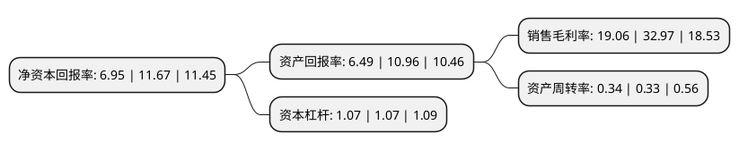

> 本页面由自动化程序生成于 2022年5月20日 01:38
> 内容可能存在错误，如有bug请提交issue至：https://github.com/Eroleice/doc-pi/issues
{.is-warning}

# 上市公司基本情况

## 基本资料

聚辰半导体股份有限公司（以下简称“聚辰股份”）成立于2009年11月13日，上海市。于2019年12月23日在上交所科创板上市。

聚辰股份注册资本12,084.187万元，主营业务为集成电路产品的研发设计和销售，并提供应用解决方案和技术支持服务。主要产品包括EEPROM，音圈马达驱动芯片和智能卡芯片。以下是详细信息：

- 公司名称: 聚辰半导体股份有限公司
- 股票代码: 688123.SH
- 所在地: 上海 - 上海市
- 成立日期: 2009年11月13日
- 注册资本: 12,084.187万元
- 法定代表人: 陈作涛
- 主营业务: 主营业务为集成电路产品的研发设计和销售，并提供应用解决方案和技术支持服务主要产品包括EEPROM，音圈马达驱动芯片和智能卡芯片
- 公司官网: www.giantec-semi.com
- 公司介绍: 公司是一家落户于张江高科技园区的集成电路设计企业。公司主要经营模式为Fabless模式，在该模式下只从事集成电路产业链中的芯片设计和销售环节。公司目前拥有EEPROM、音圈马达驱动芯片和智能卡芯片三条主要产品线，应用于智能手机，通讯，汽车电子，工业控制等多种领域。公司拥有优秀的研发能力，在EEPROM细分领域技术储备深厚。优质的客户资源，丰富的产业链协同经验以及专业的技术人才都是公司的竞争优势。公司目前为全球领先的EEPROM设计企业，公司2018年市占率全球第三，国内排名第一。手机摄像头EEPROM领域市占率达43%。

## 股东及高管情况

上市公司第一大股东为江西和光投资管理有限公司，持股25,703,785股，占比21.27%，**疑似为**上市公司实际控制人。

截至2022年03月31日，上市公司的前十大股东中，共有8名机构股东，2个产品账户，其中5%以上大股东共有3名。上市公司前十大股东明细如下：

> 未能通过持股比例判定出上市公司实际控制人（持股30%以上）
> 可能存在通过间接持股、联合持股、协议控制等方式拥有实际控制权的主体，具体请参考上市公司定期公告！
{.is-warning}

> 截至2022年03月31日，上市公司前十大股东信息如下：

| 股东名称 | 持股数量（股） | 持股比例 |
| --- | --- | --- |
| 江西和光投资管理有限公司 | 25,703,785 | 21.27% |
| 聚辰半导体(香港)有限公司 | 11,268,552 | 9.33% |
| 桐乡市亦鼎股权投资合伙企业(普通合伙) | 9,778,611 | 8.09% |
| 北京珞珈天壕投资中心(有限合伙) | 5,587,777 | 4.62% |
| 武汉珞珈梧桐新兴产业投资基金合伙企业(有限合伙) | 5,587,777 | 4.62% |
| 澜起投资有限公司 | 5,489,500 | 4.54% |
| 北京新越成长投资中心(有限合伙) | 5,169,873 | 4.28% |
| 宁波梅山保税港区登矽全投资管理合伙企业(有限合伙) | 4,600,205 | 3.81% |
| 聚祥有限公司 | 4,131,149 | 3.42% |
| 兴业银行股份有限公司-兴全趋势投资混合型证券投资基金 | 2,222,511 | 1.84% |

## 利润表分析

上市公司2021年总收入为5.44亿元，净利润为1.03亿元，实现盈利。

## 杜邦分析

> 数据列示周期：2021年 | 2020年 | 2019年
{.is-info}

上市公司的净资产收益率在近一年有所下降，下降幅度为-40.45%，其变化情况分解如下：
- 上市公司的销售毛利率在近一年下降了-42.19%，可能是生产效率的下降、商品原材料价格上涨或商品价格的下跌所致。
- 上市公司的资产周转率在近一年上升了3.03%，可能是源自于更快的销售回款或库存管理效果提升。
- 上市公司的财务杠杆比率在近一年下降了0%，可能是减少负债降低财务费用。

