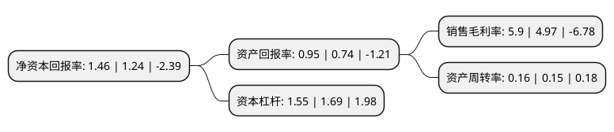

> 本页面由自动化程序生成于 2022年5月20日 01:38
> 内容可能存在错误，如有bug请提交issue至：https://github.com/Eroleice/doc-pi/issues
{.is-warning}

# 上市公司基本情况

## 基本资料

上海硅产业集团股份有限公司（以下简称“沪硅产业-U”）成立于2015年12月09日，上海市。于2020年04月20日在上交所科创板上市。

沪硅产业-U注册资本272,029.84万元，主要从事半导体硅片的研发，生产和销售公司，主要产品为300mm及以下的半导体硅片。以下是详细信息：

- 公司名称: 上海硅产业集团股份有限公司
- 股票代码: 688126.SH
- 所在地: 上海 - 上海市
- 成立日期: 2015年12月09日
- 注册资本: 272,029.84万元
- 法定代表人: 俞跃辉
- 主营业务: 主要从事半导体硅片的研发，生产和销售公司，主要产品为300mm及以下的半导体硅片
- 公司官网: www.nsig.com
- 公司介绍: 公司目前已成为中国少数具有一定国际竞争力的半导体硅片企业，产品得到了众多国内外客户的认可。公司目前已成为多家主流半导体企业的供应商，提供的产品类型涵盖300mm抛光片及外延片、200mm及以下抛光片、外延片及SOI硅片。公司主要从事半导体硅片的研发、生产和销售，是中国大陆规模最大的半导体硅片制造企业之一，是中国大陆率先实现300mm半导体硅片规模化销售的企业。硅产业集团自设立以来，坚持面向国家半导体行业的重大战略需求，坚持全球化布局，坚持紧跟国际前沿技术，突破了多项半导体硅片制造领域的关键核心技术，打破了我国300mm半导体硅片国产化率几乎为0%的局面，推进了我国半导体关键材料生产技术“自主可控”的进程。公司的技术水平和科技创新能力国内领先，公司及控股子公司拥有已获授权的专利300项，其中中国大陆105项，中国台湾地区及国外195项；公司及控股子公司拥有已获授权的发明专利273项。

## 股东及高管情况

上市公司第一大股东为上海国盛(集团)有限公司，持股567,000,000股，占比20.84%，**疑似为**上市公司实际控制人。

截至2022年03月31日，上市公司的前十大股东中，共有6名机构股东，4个产品账户，其中5%以上大股东共有5名。上市公司前十大股东明细如下：

> 未能通过持股比例判定出上市公司实际控制人（持股30%以上）
> 可能存在通过间接持股、联合持股、协议控制等方式拥有实际控制权的主体，具体请参考上市公司定期公告！
{.is-warning}

> 截至2022年03月31日，上市公司前十大股东信息如下：

| 股东名称 | 持股数量（股） | 持股比例 |
| --- | --- | --- |
| 上海国盛(集团)有限公司 | 567,000,000 | 20.84% |
| 国家集成电路产业投资基金股份有限公司 | 567,000,000 | 20.84% |
| 上海嘉定工业区开发(集团)有限公司 | 150,178,253 | 5.52% |
| 上海武岳峰集成电路股权投资合伙企业(有限合伙) | 140,400,000 | 5.16% |
| 上海新阳半导体材料股份有限公司 | 139,653,500 | 5.13% |
| 上海新微科技集团有限公司 | 124,080,000 | 4.56% |
| 华芯投资管理有限责任公司-国家集成电路产业投资基金二期股份有限公司 | 72,011,521 | 2.65% |
| 中国工商银行股份有限公司-诺安成长股票型证券投资基金 | 63,489,043 | 2.33% |
| 招商银行股份有限公司-银河创新成长混合型证券投资基金 | 59,308,567 | 2.18% |
| 上海盛石资本管理有限公司-台州中硅股权投资合伙企业(有限合伙) | 39,078,252 | 1.44% |

## 利润表分析

上市公司2021年总收入为24.66亿元，净利润为1.45亿元，实现盈利。

## 杜邦分析

> 数据列示周期：2021年 | 2020年 | 2019年
{.is-info}

上市公司的净资产收益率在近一年有所上升，上升幅度为17.74%，其变化情况分解如下：
- 上市公司的销售毛利率在近一年上升了18.71%，可能是生产效率的提升、商品原材料价格下跌或商品价格的上涨所致。
- 上市公司的资产周转率在近一年上升了6.67%，可能是源自于更快的销售回款或库存管理效果提升。
- 上市公司的财务杠杆比率在近一年下降了-8.28%，可能是减少负债降低财务费用。

