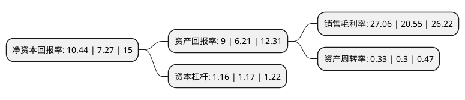

> 本页面由自动化程序生成于 2022年5月20日 01:38
> 内容可能存在错误，如有bug请提交issue至：https://github.com/Eroleice/doc-pi/issues
{.is-warning}

# 上市公司基本情况

## 基本资料

广东利扬芯片测试股份有限公司（以下简称“利扬芯片”）成立于2010年02月10日，东莞市。于2020年11月11日在上交所科创板上市。

利扬芯片注册资本13,640万元，集成电路制造中的测试方案开发，晶圆测试，芯片成品测试，并能提供芯片验证测试分析，测试软件开发，MPW(多项目晶圆)验证测试分析，ProbeCard(探针卡)，LoadBoard(搭载基板)，Kit(测试治具)，Socket(测试夹具)的设计和制作等相关配套服务。以下是详细信息：

- 公司名称: 广东利扬芯片测试股份有限公司
- 股票代码: 688135.SH
- 所在地: 广东 - 东莞市
- 成立日期: 2010年02月10日
- 注册资本: 13,640万元
- 法定代表人: 黄江
- 主营业务: 集成电路制造中的测试方案开发，晶圆测试，芯片成品测试，并能提供芯片验证测试分析，测试软件开发，MPW(多项目晶圆)验证测试分析，ProbeCard(探针卡)，LoadBoard(搭载基板)，Kit(测试治具)，Socket(测试夹具)的设计和制作等相关配套服务
- 公司官网: www.leadyo.com
- 公司介绍: 公司是国内知名的独立第三方集成电路测试服务商，主营业务包括集成电路测试方案开发、12英寸及8英寸晶圆测试服务、芯片成品测试服务以及与集成电路测试相关的配套服务。公司为汇顶科技、全志科技、国民技术、东软载波、博通集成、锐能微、比特微、西南集成、中兴微、智芯微、紫光同芯、集创北方、博雅科技、华大半导体、高云半导体等众多行业内知名的芯片设计企业提供测试服务,公司经过多年的发展，已成为国内最大的独立第三方集成电路测试基地之一。自公司成立以来，先后被评为民营科技型企业、国家级高新技术企业、中国IC风云榜2019年度新锐公司等。

## 股东及高管情况

上市公司第一大股东为黄江，持股41,343,800股，占比30.31%，为上市公司实际控制人。

截至2022年03月31日，上市公司的前十大股东中，共有8名自然人股东，1名机构股东，1个产品账户，其中5%以上大股东共有2名。上市公司前十大股东明细如下：

> 截至2022年03月31日，上市公司前十大股东信息如下：

| 股东名称 | 持股数量（股） | 持股比例 |
| --- | --- | --- |
| 黄江 | 41,343,800 | 30.31% |
| 瞿昊 | 6,918,400 | 5.07% |
| 张利平 | 6,818,400 | 5% |
| 黄主 | 4,362,000 | 3.2% |
| 徐杰锋 | 3,850,000 | 2.82% |
| 洪振辉 | 2,525,800 | 1.85% |
| 深圳市达晨创坤股权投资企业(有限合伙) | 2,331,176 | 1.71% |
| 赵吉 | 1,500,000 | 1.1% |
| 招商银行股份有限公司-富国科创板两年定期开放混合型证券投资基金 | 1,471,959 | 1.08% |
| 潘家明 | 1,441,094 | 1.06% |

## 利润表分析

上市公司2021年总收入为3.91亿元，净利润为1.05亿元，实现盈利。

## 杜邦分析

> 数据列示周期：2021年 | 2020年 | 2019年
{.is-info}

上市公司的净资产收益率在近一年有所上升，上升幅度为43.6%，其变化情况分解如下：
- 上市公司的销售毛利率在近一年上升了31.68%，可能是生产效率的提升、商品原材料价格下跌或商品价格的上涨所致。
- 上市公司的资产周转率在近一年上升了10%，可能是源自于更快的销售回款或库存管理效果提升。
- 上市公司的财务杠杆比率在近一年下降了-0.85%，可能是减少负债降低财务费用。

