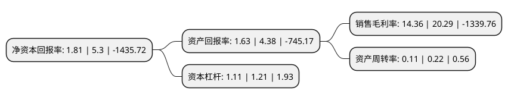

> 本页面由自动化程序生成于 2022年5月20日 01:38
> 内容可能存在错误，如有bug请提交issue至：https://github.com/Eroleice/doc-pi/issues
{.is-warning}

# 上市公司基本情况

## 基本资料

上海概伦电子股份有限公司（以下简称“概伦电子”）成立于2010年03月18日，上海市。于2021年12月28日在上交所科创板上市。

概伦电子注册资本43,380.445万元，主营业务为向客户提供被全球领先集成电路设计和制造企业长期广泛验证和使用的EDA产品及解决方案，主要产品及服务包括制造类EDA工具，设计类EDA工具，半导体器件特性测试仪器和半导体工程服务等。以下是详细信息：

- 公司名称: 上海概伦电子股份有限公司
- 股票代码: 688206.SH
- 所在地: 上海 - 上海市
- 成立日期: 2010年03月18日
- 注册资本: 43,380.445万元
- 法定代表人: 刘志宏
- 主营业务: 主营业务为向客户提供被全球领先集成电路设计和制造企业长期广泛验证和使用的EDA产品及解决方案，主要产品及服务包括制造类EDA工具，设计类EDA工具，半导体器件特性测试仪器和半导体工程服务等
- 公司官网: www.khai-long.com,www.primarius-tech.com
- 公司介绍: 公司是一家具备国际市场竞争力的EDA企业，拥有领先的EDA关键核心技术，致力于提高集成电路行业的整体技术水平和市场价值，提供专业高效的EDA流程和工具支撑。公司的主营业务为向客户提供被全球领先集成电路设计和制造企业长期广泛验证和使用的EDA产品及解决方案，主要产品及服务包括制造类EDA工具、设计类EDA工具、半导体器件特性测试仪器和半导体工程服务等，公司通过EDA方法学创新，推动集成电路设计和制造的深度联动，加快工艺开发和芯片设计进程，提高集成电路产品的良率和性能，增强集成电路企业整体市场竞争力。公司一直坚持以前瞻性的战略定位和布局为指导，以市场竞争力为导向，持续进行技术开拓创新和产品研发升级，目前已成长为全球知名的EDA企业，其创新的EDA方法学、专业的产品和服务价值得到了行业的高度认可，公司的主要客户包括台积电、三星电子、SK海力士、美光科技、联电、中芯国际等全球领先的集成电路企业。

## 股东及高管情况

上市公司第一大股东为KLProTech   H.K. Limited，持股91,637,109股，占比21.12%，**疑似为**上市公司实际控制人。

截至2022年03月31日，上市公司的前十大股东中，共有7名机构股东，1个产品账户，2个海外主体，其中5%以上大股东共有5名。上市公司前十大股东明细如下：

> 未能通过持股比例判定出上市公司实际控制人（持股30%以上）
> 可能存在通过间接持股、联合持股、协议控制等方式拥有实际控制权的主体，具体请参考上市公司定期公告！
{.is-warning}

> 截至2022年03月31日，上市公司前十大股东信息如下：

| 股东名称 | 持股数量（股） | 持股比例 |
| --- | --- | --- |
| KLProTech   H.K. Limited | 91,637,109 | 21.12% |
| LIU ZHIHONG (刘志宏) | 70,055,723 | 16.15% |
| 共青城金秋股权投资管理合伙企业(有限合伙) | 33,588,352 | 7.74% |
| 共青城明伦投资合伙企业(有限合伙) | 30,846,366 | 7.11% |
| 共青城峰伦投资合伙企业(有限合伙) | 24,211,288 | 5.58% |
| 共青城伟伦投资合伙企业(有限合伙) | 21,667,044 | 4.99% |
| 英特尔产品(成都)有限公司 | 21,124,752 | 4.87% |
| 上海衡盈屹盛资产管理有限公司-上海衡琛创业投资中心(有限合伙) | 16,266,056 | 3.75% |
| 共青城博达投资合伙企业(有限合伙) | 14,787,324 | 3.41% |
| 共青城嘉橙股权投资合伙企业(有限合伙) | 10,773,624 | 2.48% |

## 利润表分析

上市公司2021年总收入为1.93亿元，净利润为0.27亿元，实现盈利。

## 杜邦分析

> 数据列示周期：2021年 | 2020年 | 2019年
{.is-info}

上市公司的净资产收益率在近一年有所下降，下降幅度为-65.85%，其变化情况分解如下：
- 上市公司的销售毛利率在近一年下降了-29.23%，可能是生产效率的下降、商品原材料价格上涨或商品价格的下跌所致。
- 上市公司的资产周转率在近一年下降了-50%，可能是源自于更慢的销售回款或库存管理效果下降。
- 上市公司的财务杠杆比率在近一年下降了-8.26%，可能是减少负债降低财务费用。

