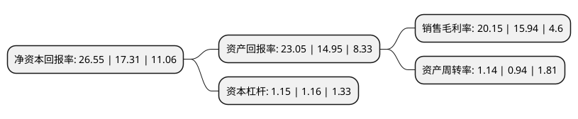

> 本页面由自动化程序生成于 2022年5月20日 01:38
> 内容可能存在错误，如有bug请提交issue至：https://github.com/Eroleice/doc-pi/issues
{.is-warning}

## 股东及高管情况

上市公司第一大股东为珠海英集投资合伙企业(有限合伙)，持股104,535,837股，占比24.89%，**疑似为**上市公司实际控制人。

截至2022年04月19日，上市公司的前十大股东中，共有9名机构股东，1个产品账户，其中5%以上大股东共有4名。上市公司前十大股东明细如下：

> 未能通过持股比例判定出上市公司实际控制人（持股30%以上）
> 可能存在通过间接持股、联合持股、协议控制等方式拥有实际控制权的主体，具体请参考上市公司定期公告！
{.is-warning}

> 截至2022年04月19日，上市公司前十大股东信息如下：

| 股东名称 | 持股数量（股） | 持股比例 |
| --- | --- | --- |
| 珠海英集投资合伙企业(有限合伙) | 104,535,837 | 24.89% |
| 上海武岳峰集成电路股权投资合伙企业(有限合伙) | 104,378,785 | 24.85% |
| 北京芯动能投资基金(有限合伙) | 36,238,895 | 8.63% |
| 共青城科苑股权投资合伙企业(有限合伙) | 25,050,036 | 5.96% |
| 长沙高新开发区和生股权投资合伙企业(有限合伙) | 14,911,255 | 3.55% |
| 珠海英芯投资合伙企业(有限合伙) | 14,341,554 | 3.41% |
| 共青城展想股权投资合伙企业(有限合伙) | 12,903,943 | 3.07% |
| 上海科技创业投资有限公司 | 7,069,470 | 1.68% |
| 成都英集芯企业管理合伙企业(有限合伙) | 6,925,208 | 1.65% |
| 佛山市景祥凯鑫股权投资合伙企业(有限合伙) | 5,771,108 | 1.37% |

## 利润表分析

上市公司2021年总收入为7.8亿元，净利润为1.57亿元，实现盈利。

## 杜邦分析

> 数据列示周期：2021年 | 2020年 | 2019年
{.is-info}

上市公司的净资产收益率在近一年有所上升，上升幅度为53.38%，其变化情况分解如下：
- 上市公司的销售毛利率在近一年上升了26.41%，可能是生产效率的提升、商品原材料价格下跌或商品价格的上涨所致。
- 上市公司的资产周转率在近一年上升了21.28%，可能是源自于更快的销售回款或库存管理效果提升。
- 上市公司的财务杠杆比率在近一年下降了-0.86%，可能是减少负债降低财务费用。

