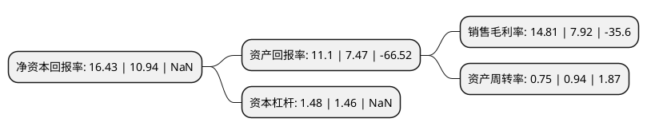

> 本页面由自动化程序生成于 2022年5月20日 01:38
> 内容可能存在错误，如有bug请提交issue至：https://github.com/Eroleice/doc-pi/issues
{.is-warning}

## 股东及高管情况

上市公司第一大股东为徐辰，持股54,828,443股，占比13.7068%，**疑似为**上市公司实际控制人。

截至2022年05月20日，上市公司的前十大股东中，共有3名自然人股东，2名机构股东，2个产品账户，3个海外主体，其中5%以上大股东共有5名。上市公司前十大股东明细如下：

> 未能通过持股比例判定出上市公司实际控制人（持股30%以上）
> 可能存在通过间接持股、联合持股、协议控制等方式拥有实际控制权的主体，具体请参考上市公司定期公告！
{.is-warning}

> 截至2022年05月20日，上市公司前十大股东信息如下：

| 股东名称 | 持股数量（股） | 持股比例 |
| --- | --- | --- |
| 徐辰 | 54,828,443 | 13.7068% |
| 国家集成电路产业投资基金二期股份有限公司 | 29,543,603 | 7.3857% |
| Forebright Smart Eyes Technology Limited | 28,324,932 | 7.0811% |
| Brizan China Holdings Limited | 27,878,777 | 6.9695% |
| 莫要武 | 23,968,856 | 5.9921% |
| 共青城思智威科技产业投资合伙企业(有限合伙) | 19,374,294 | 4.8435% |
| 马伟剑 | 16,404,798 | 4.1011% |
| 南京甄远贰号股权投资合伙企业(有限合伙) | 10,845,193 | 2.7112% |
| 北京芯动能投资基金(有限合伙) | 9,370,089 | 2.3425% |
| Hubble Ventures Co., Limited | 7,912,561 | 1.9781% |

## 杜邦分析

> 数据列示周期：2021年 | 2020年 | 2019年
{.is-info}

上市公司的净资产收益率在近一年有所上升，上升幅度为50.18%，其变化情况分解如下：
- 上市公司的销售毛利率在近一年上升了86.99%，可能是生产效率的提升、商品原材料价格下跌或商品价格的上涨所致。
- 上市公司的资产周转率在近一年下降了-20.21%，可能是源自于更慢的销售回款或库存管理效果下降。
- 上市公司的财务杠杆比率在近一年上升了1.37%，可能是增加负债扩大生产规模。

