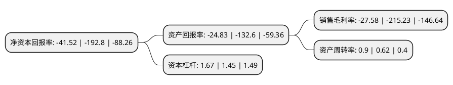

> 本页面由自动化程序生成于 2022年5月20日 01:38
> 内容可能存在错误，如有bug请提交issue至：https://github.com/Eroleice/doc-pi/issues
{.is-warning}

# 上市公司基本情况

## 基本资料

翱捷科技股份有限公司（以下简称“翱捷科技-U”）成立于2015年04月30日，上海市。于2022年01月14日在上交所科创板上市。

翱捷科技-U注册资本41,830.089万元，无线通信芯片的研发，设计及销售，同时提供芯片定制服务及半导体IP授权服务。以下是详细信息：

- 公司名称: 翱捷科技股份有限公司
- 股票代码: 688220.SH
- 所在地: 上海 - 上海市
- 成立日期: 2015年04月30日
- 注册资本: 41,830.089万元
- 法定代表人: 戴保家
- 主营业务: 无线通信芯片的研发，设计及销售，同时提供芯片定制服务及半导体IP授权服务
- 公司官网: www.asrmicro.com
- 公司介绍: 公司是一家提供无线通信、超大规模芯片的平台型芯片的企业。公司自设立以来一直专注于无线通信芯片的研发和技术创新，是国内极少数同时拥有全制式蜂窝基带芯片及多协议非蜂窝物联网芯片研发设计实力，且具备提供超大规模高速SoC芯片定制及半导体IP授权服务能力的平台型芯片设计企业。公司的芯片产品最终应用领域可以划分为消费电子和智能物联网设备两大应用领域。消费电子市场主要以个人使用的终端设备为主，可分为手机、智能可穿戴设备等产品。智能物联网设备主要以工业、商用终端设备为主，可涵盖工业物联网、车联网、智能家居、智能支付、智能表计、智慧城市、智慧安防、移动宽带设备等各个领域。公司曾获“上海设计100+奖”、“2020年度中国最具成长性新兴企业”、“2020胡润中国独角兽榜单”、“投资界硬核科技TOP100”等荣誉。

## 股东及高管情况

上市公司第一大股东为阿里巴巴(中国)网络技术有限公司，持股64,557,440股，占比15.43%，**疑似为**上市公司实际控制人。

截至2022年03月31日，上市公司的前十大股东中，共有1名自然人股东，6名机构股东，3个产品账户，其中5%以上大股东共有7名。上市公司前十大股东明细如下：

> 未能通过持股比例判定出上市公司实际控制人（持股30%以上）
> 可能存在通过间接持股、联合持股、协议控制等方式拥有实际控制权的主体，具体请参考上市公司定期公告！
{.is-warning}

> 截至2022年03月31日，上市公司前十大股东信息如下：

| 股东名称 | 持股数量（股） | 持股比例 |
| --- | --- | --- |
| 阿里巴巴(中国)网络技术有限公司 | 64,557,440 | 15.43% |
| 翱捷科技股份有限公司未确认持有人证券专用账户 | 45,121,444 | 10.79% |
| 宁波捷芯睿微企业管理合伙企业(有限合伙) | 38,013,676 | 9.09% |
| 戴保家 | 35,242,880 | 8.43% |
| 深圳市前海万容红土投资基金(有限合伙) | 23,063,040 | 5.51% |
| 上海浦东新星纽士达创业投资有限公司 | 22,152,640 | 5.3% |
| 义乌和谐锦弘股权投资合伙企业(有限合伙) | 21,110,080 | 5.05% |
| 深圳市创新投资集团有限公司 | 13,708,160 | 3.28% |
| 福建省安芯产业投资基金合伙企业(有限合伙) | 13,083,520 | 3.13% |
| 上海浦东新兴产业投资有限公司 | 9,076,160 | 2.17% |

## 杜邦分析

> 数据列示周期：2021年 | 2020年 | 2019年
{.is-info}

上市公司的净资产收益率在近一年有所下降，下降幅度为-78.46%，其变化情况分解如下：
- 上市公司的销售毛利率在近一年下降了-87.19%，可能是生产效率的下降、商品原材料价格上涨或商品价格的下跌所致。
- 上市公司的资产周转率在近一年上升了45.16%，可能是源自于更快的销售回款或库存管理效果提升。
- 上市公司的财务杠杆比率在近一年上升了15.17%，可能是增加负债扩大生产规模。

