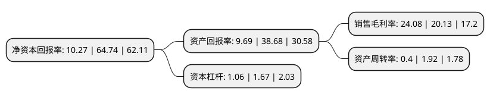

> 本页面由自动化程序生成于 2022年5月20日 01:38
> 内容可能存在错误，如有bug请提交issue至：https://github.com/Eroleice/doc-pi/issues
{.is-warning}

# 上市公司基本情况

## 基本资料

上海芯导电子科技股份有限公司（以下简称“芯导科技”）成立于2009年11月26日，上海市。于2021年12月01日在上交所科创板上市。

芯导科技注册资本6,000万元，公司功率半导体产品包括功率器件和功率IC两大类，主营业务为功率半导体的研发与销售。以下是详细信息：

- 公司名称: 上海芯导电子科技股份有限公司
- 股票代码: 688230.SH
- 所在地: 上海 - 上海市
- 成立日期: 2009年11月26日
- 注册资本: 6,000万元
- 法定代表人: 欧新华
- 主营业务: 公司功率半导体产品包括功率器件和功率IC两大类，主营业务为功率半导体的研发与销售
- 公司官网: www.prisemi.com
- 公司介绍: 公司是上海市规划布局内重点集成电路设计企业、上海市科技小巨人企业、上海市高新技术企业、上海市三星级诚信创建企业、“专精特新”企业、上海市集成电路行业协会第五届理事会理事单位，公司的TVS管、ESD保护器件、三极管、稳压管、大功率低功耗MOSFET等多种功率半导体产品被认定为上海市高新技术成果转化项目。公司各类产品广泛应用于小米、TCL、传音等品牌客户以及华勤、闻泰、龙旗等ODM客户。多年来，公司在消费电子行业中积累了良好的口碑，形成了一定的品牌优势。目前公司以经销模式为主，公司产品的客户认知度和忠诚度均较高，公司品牌获得了客户和经销商的认可。随着公司业务的增长，公司将进一步提升公司品牌优势，与业绩增长形成良性循环。

## 股东及高管情况

上市公司第一大股东为上海莘导企业管理有限公司，持股22,950,000股，占比38.25%，为上市公司实际控制人。

截至2022年03月31日，上市公司的前十大股东中，共有5名自然人股东，4名机构股东，1个产品账户，其中5%以上大股东共有3名。上市公司前十大股东明细如下：

> 截至2022年03月31日，上市公司前十大股东信息如下：

| 股东名称 | 持股数量（股） | 持股比例 |
| --- | --- | --- |
| 上海莘导企业管理有限公司 | 22,950,000 | 38.25% |
| 欧新华 | 18,000,000 | 30% |
| 上海萃慧企业管理服务中心(有限合伙) | 4,050,000 | 6.75% |
| 国元证券-招商银行-国元证券芯导科技员工参与科创板战略配售集合资产管理计划 | 362,153 | 0.6% |
| 赵建平 | 300,000 | 0.5% |
| 杨春旭 | 130,734 | 0.22% |
| 中国中金财富证券有限公司 | 119,594 | 0.2% |
| 江苏省金鹏电站输变电工程有限公司 | 103,500 | 0.17% |
| 刘月明 | 101,200 | 0.17% |
| 李秀根 | 93,400 | 0.16% |

## 利润表分析

上市公司2021年总收入为4.75亿元，净利润为1.14亿元，实现盈利。

## 杜邦分析

> 数据列示周期：2021年 | 2020年 | 2019年
{.is-info}

上市公司的净资产收益率在近一年有所下降，下降幅度为-84.14%，其变化情况分解如下：
- 上市公司的销售毛利率在近一年上升了19.62%，可能是生产效率的提升、商品原材料价格下跌或商品价格的上涨所致。
- 上市公司的资产周转率在近一年下降了-79.17%，可能是源自于更慢的销售回款或库存管理效果下降。
- 上市公司的财务杠杆比率在近一年下降了-36.53%，可能是减少负债降低财务费用。

