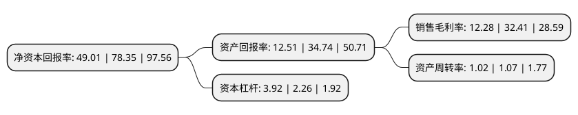

> 本页面由自动化程序生成于 2022年5月20日 01:38
> 内容可能存在错误，如有bug请提交issue至：https://github.com/Eroleice/doc-pi/issues
{.is-warning}

# 上市公司基本情况

## 基本资料

创耀(苏州)通信科技股份有限公司（以下简称“创耀科技”）成立于2006年08月02日，苏州市。于2022年01月12日在上交所科创板上市。

创耀科技注册资本8,000万元，主营业务包括电力线载波通信芯片与解决方案业务，接入网网络芯片与解决方案业务和芯片版图设计服务及其他技术服务。以下是详细信息：

- 公司名称: 创耀(苏州)通信科技股份有限公司
- 股票代码: 688259.SH
- 所在地: 江苏 - 苏州市
- 成立日期: 2006年08月02日
- 注册资本: 8,000万元
- 法定代表人: YAOLONG TAN
- 主营业务: 主营业务包括电力线载波通信芯片与解决方案业务，接入网网络芯片与解决方案业务和芯片版图设计服务及其他技术服务
- 公司官网: www.triductor.com
- 公司介绍: 公司是一家专业的集成电路设计企业，主要专注于通信核心芯片的研发、设计和销售业务，并提供应用解决方案与技术支持服务。公司为国家高新技术企业、江苏省省级工程技术研究中心，是中国通信标准化协会会员。公司自成立以来深耕基于铜线传输的通信技术领域，致力于提供更好的宽带接入和智能家庭通信解决方案，实现关键技术和芯片产品的国产化，是国内较早研发并掌握基于VDSL2技术的宽带接入技术和宽带电力线载波通信技术的企业，并始终以研发和创新为发展驱动，持续推进技术的演进。目前，公司已在电力线载波通信芯片相关的算法与软件、接入网网络芯片相关的算法与软件、模拟电路设计、数模混合和版图设计等方面形成了诸多核心技术，主要产品和技术处于国内先进水平。公司具备优秀的数模混合SoC芯片全流程设计能力，并打造了一支能力全面、经验丰富的研发团队，是国内少数几家较具规模的同时具备物理层核心通信算法能力和大型SoC芯片设计能力的公司之一，并同时具备65nm/40nm/28nmCMOS工艺节点和14nm/7nm/5nmFinFET先进工艺节点物理设计能力。

## 股东及高管情况

上市公司第一大股东为重庆创睿盈企业管理有限公司，持股22,111,200股，占比27.64%，**疑似为**上市公司实际控制人。

截至2022年03月31日，上市公司的前十大股东中，共有9名机构股东，1个产品账户，其中5%以上大股东共有3名。上市公司前十大股东明细如下：

> 未能通过持股比例判定出上市公司实际控制人（持股30%以上）
> 可能存在通过间接持股、联合持股、协议控制等方式拥有实际控制权的主体，具体请参考上市公司定期公告！
{.is-warning}

> 截至2022年03月31日，上市公司前十大股东信息如下：

| 股东名称 | 持股数量（股） | 持股比例 |
| --- | --- | --- |
| 重庆创睿盈企业管理有限公司 | 22,111,200 | 27.64% |
| 宁波保税区凯风创业投资管理有限公司-宁波保税区凯风厚泽股权投资合伙企业(有限合伙) | 11,320,560 | 14.15% |
| 中新苏州工业园区创业投资有限公司 | 4,743,540 | 5.93% |
| 长江成长资本投资有限公司 | 3,319,860 | 4.15% |
| 宁波保税区美圣投资合伙企业(有限合伙) | 2,919,600 | 3.65% |
| 宁波保税区敏玥投资合伙企业(有限合伙) | 2,614,680 | 3.27% |
| 英飞尼迪(珠海)创业投资管理有限公司-珠海中以英飞新兴产业投资基金(有限合伙) | 2,595,240 | 3.24% |
| 宁波保税区惠毅投资合伙企业(有限合伙) | 2,277,300 | 2.85% |
| 南京江宁科技创业投资集团有限公司 | 1,626,780 | 2.03% |
| 成都晟唐银科创业投资企业(有限合伙) | 1,626,780 | 2.03% |

## 利润表分析

上市公司2021年总收入为6.4亿元，净利润为0.78亿元，实现盈利。

## 杜邦分析

> 数据列示周期：2021年 | 2020年 | 2019年
{.is-info}

上市公司的净资产收益率在近一年有所下降，下降幅度为-37.45%，其变化情况分解如下：
- 上市公司的销售毛利率在近一年下降了-62.11%，可能是生产效率的下降、商品原材料价格上涨或商品价格的下跌所致。
- 上市公司的资产周转率在近一年下降了-4.67%，可能是源自于更慢的销售回款或库存管理效果下降。
- 上市公司的财务杠杆比率在近一年上升了73.45%，可能是增加负债扩大生产规模。

