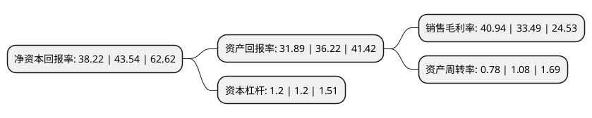

> 本页面由自动化程序生成于 2022年5月20日 01:39
> 内容可能存在错误，如有bug请提交issue至：https://github.com/Eroleice/doc-pi/issues
{.is-warning}

## 股东及高管情况

上市公司第一大股东为峰岹科技(香港)有限公司，持股35,154,431股，占比38.061%，为上市公司实际控制人。

截至2022年04月20日，上市公司的前十大股东中，共有7名机构股东，2个产品账户，1名其他股东，其中5%以上大股东共有3名。上市公司前十大股东明细如下：

> 截至2022年04月20日，上市公司前十大股东信息如下：

| 股东名称 | 持股数量（股） | 持股比例 |
| --- | --- | --- |
| 峰岹科技(香港)有限公司 | 35,154,431 | 38.061% |
| 上海华芯创业投资企业 | 13,465,723 | 14.5791% |
| 深圳市芯齐投资企业(有限合伙) | 4,812,900 | 5.2108% |
| 深圳微禾投资有限公司 | 2,702,050 | 2.9255% |
| 上海聚源聚芯集成电路产业股权投资基金中心(有限合伙) | 2,075,581 | 2.2472% |
| 海通证券股份有限公司 | 1,825,475 | 1.9764% |
| 湖北小米长江产业基金合伙企业(有限合伙) | 1,406,570 | 1.5229% |
| 芯运科技(深圳)有限公司 | 1,350,716 | 1.4624% |
| 南京俱成秋实股权投资合伙企业(有限合伙) | 1,297,239 | 1.4045% |
| 青岛康润华创投资管理中心(有限合伙) | 1,037,791 | 1.1236% |

## 利润表分析

上市公司2021年总收入为3.3亿元，净利润为1.35亿元，实现盈利。

## 杜邦分析

> 数据列示周期：2021年 | 2020年 | 2019年
{.is-info}

上市公司的净资产收益率在近一年有所下降，下降幅度为-12.22%，其变化情况分解如下：
- 上市公司的销售毛利率在近一年上升了22.25%，可能是生产效率的提升、商品原材料价格下跌或商品价格的上涨所致。
- 上市公司的资产周转率在近一年下降了-27.78%，可能是源自于更慢的销售回款或库存管理效果下降。
- 上市公司的财务杠杆比率在近一年下降了0%，可能是减少负债降低财务费用。

