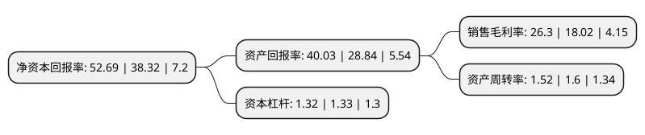

> 本页面由自动化程序生成于 2022年5月20日 01:39
> 内容可能存在错误，如有bug请提交issue至：https://github.com/Eroleice/doc-pi/issues
{.is-warning}

## 股东及高管情况

上市公司第一大股东为东莞市伟途投资管理合伙企业(有限合伙)，持股17,610,600股，占比22.01%，**疑似为**上市公司实际控制人。

截至2022年04月22日，上市公司的前十大股东中，共有9名机构股东，1个产品账户，其中5%以上大股东共有5名。上市公司前十大股东明细如下：

> 未能通过持股比例判定出上市公司实际控制人（持股30%以上）
> 可能存在通过间接持股、联合持股、协议控制等方式拥有实际控制权的主体，具体请参考上市公司定期公告！
{.is-warning}

> 截至2022年04月22日，上市公司前十大股东信息如下：

| 股东名称 | 持股数量（股） | 持股比例 |
| --- | --- | --- |
| 东莞市伟途投资管理合伙企业(有限合伙) | 17,610,600 | 22.01% |
| 上海武岳峰集成电路股权投资合伙企业(有限合伙) | 9,778,735 | 12.22% |
| 上海物联网二期创业投资基金合伙企业(有限合伙) | 5,790,435 | 7.24% |
| 苏州邦盛赢新创业投资企业(有限合伙) | 5,674,623 | 7.09% |
| 珠海市聚核投资合伙企业(有限合伙) | 4,799,999 | 6% |
| 北京武岳峰亦合高科技产业投资合伙企业(有限合伙) | 3,348,874 | 4.19% |
| 东莞市微合投资管理合伙企业(有限合伙) | 2,642,485 | 3.3% |
| 上海岭观企业管理合伙企业(有限合伙) | 2,411,190 | 3.01% |
| 深圳市前海弘盛技术有限公司 | 2,105,813 | 2.63% |
| 深圳市毕方一号投资中心(有限合伙) | 2,052,741 | 2.57% |

## 利润表分析

上市公司2021年总收入为3.39亿元，净利润为0.89亿元，实现盈利。

## 杜邦分析

> 数据列示周期：2021年 | 2020年 | 2019年
{.is-info}

上市公司的净资产收益率在近一年有所上升，上升幅度为37.5%，其变化情况分解如下：
- 上市公司的销售毛利率在近一年上升了45.95%，可能是生产效率的提升、商品原材料价格下跌或商品价格的上涨所致。
- 上市公司的资产周转率在近一年下降了-5%，可能是源自于更慢的销售回款或库存管理效果下降。
- 上市公司的财务杠杆比率在近一年下降了-0.75%，可能是减少负债降低财务费用。

