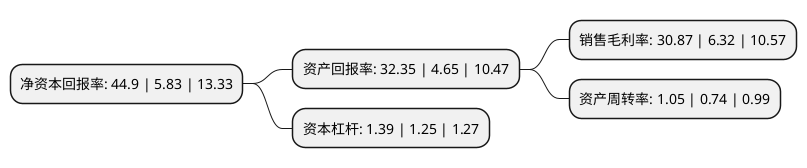

> 本页面由自动化程序生成于 2022年5月20日 01:39
> 内容可能存在错误，如有bug请提交issue至：https://github.com/Eroleice/doc-pi/issues
{.is-warning}

# 上市公司基本情况

## 基本资料

上海晶丰明源半导体股份有限公司（以下简称“晶丰明源”）成立于2008年10月31日，上海市。于2019年10月14日在上交所科创板上市。

晶丰明源注册资本6,203.008万元，主营业务为电源管理驱动类芯片的研发与销售，公司产品包括LED照明驱动芯片，电机驱动芯片等电源管理驱动类芯片。以下是详细信息：

- 公司名称: 上海晶丰明源半导体股份有限公司
- 股票代码: 688368.SH
- 所在地: 上海 - 上海市
- 成立日期: 2008年10月31日
- 注册资本: 6,203.008万元
- 法定代表人: 胡黎强
- 主营业务: 主营业务为电源管理驱动类芯片的研发与销售，公司产品包括LED照明驱动芯片，电机驱动芯片等电源管理驱动类芯片
- 公司官网: www.bpsemi.com
- 公司介绍: 公司是国内领先的电源管理驱动类芯片设计企业之一。公司采用Fabless模式，拥有行业领先的模拟芯片设计能力，并多次引领细分行业技术革新。主营业务为电源管理驱动类芯片的研发与销售，公司产品包括LED照明驱动芯片、电机驱动芯片等电源管理驱动类芯片。公司在高精度恒流技术等方面实现了技术突破，掌握了“寄生电容耦合及线电压补偿恒流技术”、“单电阻过压保护技术”、“过温闭环控制降电流技术”等LED照明驱动芯片设计的关键性技术，推出了LED照明驱动的整体解决方案。根据国家半导体照明工程研发及产业联盟(CSA)统计，公司2016年国内LED照明驱动芯片市场占有率约为28.80％，市场占有率较高。

## 股东及高管情况

上市公司第一大股东为胡黎强，持股16,564,500股，占比26.7%，**疑似为**上市公司实际控制人。

截至2022年03月31日，上市公司的前十大股东中，共有2名自然人股东，4名机构股东，2个产品账户，1个海外主体，1名其他股东，其中5%以上大股东共有3名。上市公司前十大股东明细如下：

> 未能通过持股比例判定出上市公司实际控制人（持股30%以上）
> 可能存在通过间接持股、联合持股、协议控制等方式拥有实际控制权的主体，具体请参考上市公司定期公告！
{.is-warning}

> 截至2022年03月31日，上市公司前十大股东信息如下：

| 股东名称 | 持股数量（股） | 持股比例 |
| --- | --- | --- |
| 胡黎强 | 16,564,500 | 26.7% |
| 夏风 | 15,115,500 | 24.37% |
| 上海晶哲瑞企业管理中心(有限合伙) | 13,320,000 | 21.47% |
| 招商银行股份有限公司-睿远成长价值混合型证券投资基金 | 983,600 | 1.59% |
| 香港中央结算有限公司(陆股通) | 904,403 | 1.46% |
| 苏州奥银湖杉投资合伙企业(有限合伙) | 750,000 | 1.21% |
| 广发乾和投资有限公司 | 705,716 | 1.14% |
| 招商银行股份有限公司-华夏上证科创板50成份交易型开放式指数证券投资基金 | 510,371 | 0.82% |
| 澳门金融管理局-自有资金 | 421,887 | 0.68% |
| 中信证券股份有限公司 | 367,226 | 0.59% |

## 利润表分析

上市公司2021年总收入为23.02亿元，净利润为7.1亿元，实现盈利。

## 杜邦分析

> 数据列示周期：2021年 | 2020年 | 2019年
{.is-info}

上市公司的净资产收益率在近一年有所上升，上升幅度为670.15%，其变化情况分解如下：
- 上市公司的销售毛利率在近一年上升了388.45%，可能是生产效率的提升、商品原材料价格下跌或商品价格的上涨所致。
- 上市公司的资产周转率在近一年上升了41.89%，可能是源自于更快的销售回款或库存管理效果提升。
- 上市公司的财务杠杆比率在近一年上升了11.2%，可能是增加负债扩大生产规模。

