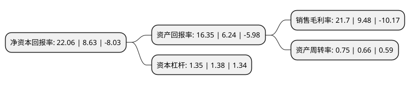

> 本页面由自动化程序生成于 2022年5月20日 01:39
> 内容可能存在错误，如有bug请提交issue至：https://github.com/Eroleice/doc-pi/issues
{.is-warning}

# 上市公司基本情况

## 基本资料

上海复旦微电子集团股份有限公司（以下简称“复旦微电”）成立于1998年07月10日，上海市。于2021年08月04日在上交所科创板上市。

复旦微电注册资本81,450.2万元，主要产品包括安全与识别芯片，非挥发存储器，智能电表芯片，FPGA芯片和集成电路测试服务，从事超大规模集成电路的设计，开发，测试，并为客户提供系统解决方案。以下是详细信息：

- 公司名称: 上海复旦微电子集团股份有限公司
- 股票代码: 688385.SH
- 所在地: 上海 - 上海市
- 成立日期: 1998年07月10日
- 注册资本: 81,450.2万元
- 法定代表人: 蒋国兴
- 主营业务: 主要产品包括安全与识别芯片，非挥发存储器，智能电表芯片，FPGA芯片和集成电路测试服务，从事超大规模集成电路的设计，开发，测试，并为客户提供系统解决方案
- 公司官网: www.fmsh.com
- 公司介绍: 公司是一家从事超大规模集成电路的设计、开发、测试，并为客户提供系统解决方案的专业公司。公司目前已建立健全安全与识别芯片、非挥发存储器、智能电表芯片、FPGA芯片和集成电路测试服务等产品线，产品广泛应用于金融、社保、城市公共交通、电子证照、移动支付、防伪溯源、智能手机、安防监控、工业控制、信号处理、智能计算等众多领域。公司拥有齐全的产品线、深厚的技术储备、稳定可靠的产品质量以及较强的定制化方案开发能力，承担了多项“国家重大科技专项”项目和上海市战略性新兴产业重大项目，参与制定了信息安全技术射频识别系统密码应用技术、射频识别系统密码应用技术要求、通用NAND型快闪存储器接口等多项国家标准和行业标准。同时，基于公司长期稳定的购销需求，复旦微与集成电路产业链上下游厂商构建了牢固的供应链合作关系。目前，公司的RFID芯片、智能卡芯片、EEPROM、智能电表MCU等多类产品的市场占有率位居行业前列，且产品性能受到三星、LG、VIVO、海尔、海信、联想等国内外知名厂商的认可，打造了良好的品牌认知度。

## 股东及高管情况

上市公司第一大股东为香港中央结算(代理人)有限公司，持股284,205,990股，占比34.89%，为上市公司实际控制人。

截至2022年03月31日，上市公司的前十大股东中，共有8名机构股东，1个产品账户，1个海外主体，其中5%以上大股东共有4名。上市公司前十大股东明细如下：

> 截至2022年03月31日，上市公司前十大股东信息如下：

| 股东名称 | 持股数量（股） | 持股比例 |
| --- | --- | --- |
| 香港中央结算(代理人)有限公司 | 284,205,990 | 34.89% |
| 上海复旦复控科技产业控股有限公司 | 109,620,000 | 13.46% |
| 上海复芯凡高集成电路技术有限公司 | 106,730,000 | 13.1% |
| 上海政本企业管理咨询合伙企业(有限合伙) | 52,167,270 | 6.4% |
| 上海政化企业管理咨询合伙企业(有限合伙) | 34,650,000 | 4.25% |
| 上海国年企业管理咨询合伙企业(有限合伙) | 29,941,470 | 3.68% |
| 上海圣壕企业管理咨询合伙企业(有限合伙) | 14,741,000 | 1.81% |
| 上海年锦企业管理咨询合伙企业(有限合伙) | 14,677,840 | 1.8% |
| 中信建投基金-中信银行-中信建投基金-复旦微战略配售集合资产管理计划 | 12,000,000 | 1.47% |
| 上海煜壕企业管理咨询合伙企业(有限合伙) | 9,011,000 | 1.11% |

## 利润表分析

上市公司2021年总收入为25.77亿元，净利润为5.59亿元，实现盈利。

## 杜邦分析

> 数据列示周期：2021年 | 2020年 | 2019年
{.is-info}

上市公司的净资产收益率在近一年有所上升，上升幅度为155.62%，其变化情况分解如下：
- 上市公司的销售毛利率在近一年上升了128.9%，可能是生产效率的提升、商品原材料价格下跌或商品价格的上涨所致。
- 上市公司的资产周转率在近一年上升了13.64%，可能是源自于更快的销售回款或库存管理效果提升。
- 上市公司的财务杠杆比率在近一年下降了-2.17%，可能是减少负债降低财务费用。

