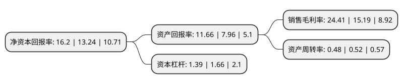

> 本页面由自动化程序生成于 2022年5月20日 01:39
> 内容可能存在错误，如有bug请提交issue至：https://github.com/Eroleice/doc-pi/issues
{.is-warning}

# 上市公司基本情况

## 基本资料

华润微电子有限公司（以下简称“华润微”）成立于2003年01月28日，null。于2020年02月27日在上交所科创板上市。

华润微注册资本132,009.186万元，主营业务可分为产品与方案，制造与服务两大业务板块。以下是详细信息：

- 公司名称: 华润微电子有限公司
- 股票代码: 688396.SH
- 所在地: null - null
- 成立日期: 2003年01月28日
- 注册资本: 132,009.186万元
- 法定代表人: 李虹
- 主营业务: 主营业务可分为产品与方案，制造与服务两大业务板块
- 公司官网: www.crmicro.com
- 公司介绍: 公司是中国领先的拥有芯片设计、晶圆制造、封装测试等全产业链一体化经营能力的半导体企业，产品聚焦于功率半导体、智能传感器与智能控制领域，为客户提供丰富的半导体产品与系统解决方案。公司产品设计自主、制造全程可控，在分立器件及集成电路领域均已具备较强的产品技术与制造工艺能力，形成了先进的特色工艺和系列化的产品线。公司是华润集团半导体投资运营平台，始终以振兴民族半导体产业为己任，曾先后整合了华科电子、中国华晶、上华科技等中国半导体先驱。公司及下属相关经营主体曾建成并运营中国第一条4英寸晶圆生产线、第一条6英寸晶圆生产线，承担了多项国家重点专项工程。经过多年发展及一系列整合，公司已成为中国本土具有重要影响力的综合性半导体企业，自2004年起连续被工信部评为中国电子信息百强企业。公司已获得包括国家技术发明二等奖、“九五”国家重点科技攻关优秀科技成果奖、教育部技术发明一等奖、教育部技术发明二等奖、省级科技进步一等奖及国家级及省部级研发项目在内的多项重要奖项。

## 股东及高管情况

上市公司第一大股东为华润集团(微电子)有限公司，持股878,982,146股，占比66.58%，为上市公司实际控制人。

截至2022年03月31日，上市公司的前十大股东中，共有2名自然人股东，3名机构股东，4个产品账户，1个海外主体，其中5%以上大股东共有1名。上市公司前十大股东明细如下：

> 截至2022年03月31日，上市公司前十大股东信息如下：

| 股东名称 | 持股数量（股） | 持股比例 |
| --- | --- | --- |
| 华润集团(微电子)有限公司 | 878,982,146 | 66.58% |
| 国家集成电路产业投资基金股份有限公司 | 64,924,082 | 4.92% |
| 重庆西永微电子产业园区开发有限公司 | 31,250,000 | 2.37% |
| 香港中央结算有限公司(陆股通) | 10,801,176 | 0.82% |
| 招商银行股份有限公司-华夏上证科创板50成份交易型开放式指数证券投资基金 | 7,692,481 | 0.58% |
| 白秀平 | 4,752,745 | 0.36% |
| 王开斌 | 4,673,422 | 0.35% |
| 深圳市中金岭南资本运营有限公司 | 4,166,666 | 0.32% |
| 中国工商银行股份有限公司-易方达上证科创板50成份交易型开放式指数证券投资基金 | 3,113,796 | 0.24% |
| 宁波宏阳投资管理合伙企业(有限合伙)-宏阳专项基金二期私募证券投资基金 | 3,006,200 | 0.23% |

## 杜邦分析

> 数据列示周期：2021年 | 2020年 | 2019年
{.is-info}

上市公司的净资产收益率在近一年有所上升，上升幅度为22.36%，其变化情况分解如下：
- 上市公司的销售毛利率在近一年上升了60.7%，可能是生产效率的提升、商品原材料价格下跌或商品价格的上涨所致。
- 上市公司的资产周转率在近一年下降了-7.69%，可能是源自于更慢的销售回款或库存管理效果下降。
- 上市公司的财务杠杆比率在近一年下降了-16.27%，可能是减少负债降低财务费用。

