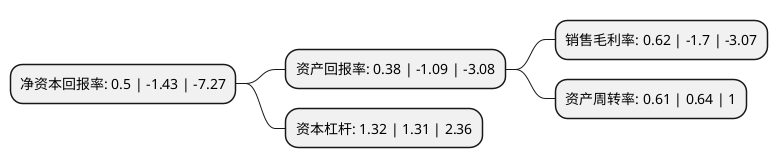

> 本页面由自动化程序生成于 2022年5月20日 01:39
> 内容可能存在错误，如有bug请提交issue至：https://github.com/Eroleice/doc-pi/issues
{.is-warning}

# 上市公司基本情况

## 基本资料

芯原微电子(上海)股份有限公司（以下简称“芯原股份-U”）成立于2001年08月21日，上海市。于2020年08月18日在上交所科创板上市。

芯原股份-U注册资本49,588.715万元，主要服务为面向消费电子，汽车电子，计算机及周边，工业，数据处理，物联网等广泛应用市场所提供的一站式芯片定制服务和半导体IP授权服务。主营业务的应用领域广泛包括消费电子，汽车电子，计算机及周边，工业，数据处理，物联网等，主要客户包括IDM，芯片设计公司，以及系统厂商，大型互联网公司等。以下是详细信息：

- 公司名称: 芯原微电子(上海)股份有限公司
- 股票代码: 688521.SH
- 所在地: 上海 - 上海市
- 成立日期: 2001年08月21日
- 注册资本: 49,588.715万元
- 法定代表人: 戴伟民
- 主营业务: 主要服务为面向消费电子，汽车电子，计算机及周边，工业，数据处理，物联网等广泛应用市场所提供的一站式芯片定制服务和半导体IP授权服务主营业务的应用领域广泛包括消费电子，汽车电子，计算机及周边，工业，数据处理，物联网等，主要客户包括IDM，芯片设计公司，以及系统厂商，大型互联网公司等
- 公司官网: www.verisilicon.com
- 公司介绍: 公司是一家依托自主半导体IP，为客户提供平台化、全方位、一站式芯片定制服务和半导体IP授权服务的企业。公司拥有多种成熟的行业应用解决方案、优秀的芯片设计能力、丰富的芯片设计经验以及深厚的半导体IP储备，能够帮助客户高效率、高质量、低成本、低风险地完成芯片的设计实现和量产出货。通过芯原提供的服务，客户可集中精力运用自身在产品定义、系统架构、软件开发及市场营销等方面的优势，并借助芯原在芯片设计和量产优化等方面的优势，完善产品功能，提升产品性能。芯原服务水平和质量受到诸多国内外知名客户的认可，主要客户包括英特尔、博世、恩智浦、博通、新突思、美满电子、索喜科技、意法半导体、三星、瑞昱等全球半导体行业知名企业；Facebook、谷歌、亚马逊等全球大型互联网公司；华为、紫光展锐、瑞芯微、中兴通讯、大华股份、晶晨股份、和芯星通等众多国内知名企业。

## 股东及高管情况

上市公司第一大股东为VeriSilicon Limited，持股77,876,777股，占比15.7%，**疑似为**上市公司实际控制人。

截至2022年03月31日，上市公司的前十大股东中，共有5名机构股东，3个产品账户，2个海外主体，其中5%以上大股东共有5名。上市公司前十大股东明细如下：

> 未能通过持股比例判定出上市公司实际控制人（持股30%以上）
> 可能存在通过间接持股、联合持股、协议控制等方式拥有实际控制权的主体，具体请参考上市公司定期公告！
{.is-warning}

> 截至2022年03月31日，上市公司前十大股东信息如下：

| 股东名称 | 持股数量（股） | 持股比例 |
| --- | --- | --- |
| VeriSilicon Limited | 77,876,777 | 15.7% |
| 富策控股有限公司 | 41,835,619 | 8.44% |
| 国家集成电路产业投资基金股份有限公司 | 34,724,272 | 7% |
| 湖北小米长江产业投资基金管理有限公司-湖北小米长江产业基金合伙企业(有限合伙) | 27,188,786 | 5.48% |
| 共青城时兴投资合伙企业(有限合伙) | 26,279,585 | 5.3% |
| 嘉兴海橙投资合伙企业(有限合伙) | 22,046,654 | 4.45% |
| 中国工商银行股份有限公司-诺安成长股票型证券投资基金 | 16,365,029 | 3.3% |
| 上海浦东新兴产业投资有限公司 | 15,624,271 | 3.15% |
| SVIC NO.33 NEW TECHNOLOGY BUSINESS INVESTMENT L.L.P. | 12,871,671 | 2.6% |
| 共青城原厚投资合伙企业(有限合伙) | 12,638,691 | 2.55% |

## 利润表分析

上市公司2021年总收入为21.39亿元，净利润为0.13亿元，实现盈利。

## 杜邦分析

> 数据列示周期：2021年 | 2020年 | 2019年
{.is-info}

上市公司的净资产收益率在近一年有所下降，下降幅度为-134.97%，其变化情况分解如下：
- 上市公司的销售毛利率在近一年下降了-136.47%，可能是生产效率的下降、商品原材料价格上涨或商品价格的下跌所致。
- 上市公司的资产周转率在近一年下降了-4.69%，可能是源自于更慢的销售回款或库存管理效果下降。
- 上市公司的财务杠杆比率在近一年上升了0.76%，可能是增加负债扩大生产规模。

