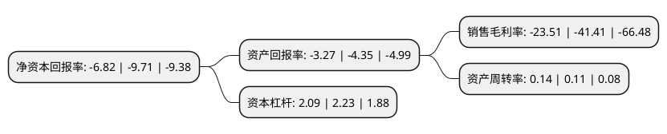

> 本页面由自动化程序生成于 2022年5月20日 01:39
> 内容可能存在错误，如有bug请提交issue至：https://github.com/Eroleice/doc-pi/issues
{.is-warning}

# 上市公司基本情况

## 基本资料

上海和辉光电股份有限公司（以下简称“和辉光电-U”）成立于2012年10月29日，上海市。于2021年05月28日在上交所科创板上市。

和辉光电-U注册资本1,380,943.763万元，公司是国内知名的AMOLED半导体显示面板制造商，专注于中小尺寸AMOLED半导体显示面板的研发，生产及销售。以下是详细信息：

- 公司名称: 上海和辉光电股份有限公司
- 股票代码: 688538.SH
- 所在地: 上海 - 上海市
- 成立日期: 2012年10月29日
- 注册资本: 1,380,943.763万元
- 法定代表人: 傅文彪
- 主营业务: 公司是国内知名的AMOLED半导体显示面板制造商，专注于中小尺寸AMOLED半导体显示面板的研发，生产及销售
- 公司官网: www.everdisplay.com
- 公司介绍: 公司是国务院国有企业改革领导小组确认的“百户科技型企业深化市场化改革提升自主创新能力专项行动”入选企业,是高新技术企业和上海市专利工作示范企业。自设立以来，公司持续深耕中小尺寸AMOLED半导体显示面板，量产产品主要应用于智能手机、智能穿戴以及平板/笔记本电脑等消费类终端电子产品，同时积极研发适用于车载显示、工控显示、医疗显示等专业显示领域的相关AMOLED半导体显示面板产品。公司是国务院国有企业改革领导小组确认的“百户科技型企业深化市场化改革提升自主创新能力专项行动”入选企业，被国家工信部评为工业企业知识产权运用试点企业，被国家知识产权局评为国家知识产权优势企业，是高新技术企业和上海市专利工作示范企业。

## 股东及高管情况

上市公司第一大股东为上海联和投资有限公司，持股8,057,201,900股，占比58.3456%，为上市公司实际控制人。

截至2022年03月31日，上市公司的前十大股东中，共有7名机构股东，3个产品账户，其中5%以上大股东共有2名。上市公司前十大股东明细如下：

> 截至2022年03月31日，上市公司前十大股东信息如下：

| 股东名称 | 持股数量（股） | 持股比例 |
| --- | --- | --- |
| 上海联和投资有限公司 | 8,057,201,900 | 58.3456% |
| 上海集成电路产业投资基金股份有限公司 | 2,239,545,000 | 16.2175% |
| 上海金联投资发展有限公司 | 429,030,000 | 3.1068% |
| 广州凯得投资控股有限公司 | 165,638,101 | 1.1995% |
| 中国保险投资基金(有限合伙) | 148,080,462 | 1.07% |
| 招商银行股份有限公司-华夏上证科创板50成份交易型开放式指数证券投资基金 | 84,423,100 | 0.61% |
| 上海科技创业投资(集团)有限公司 | 66,255,240 | 0.48% |
| 上海国鑫投资发展有限公司 | 66,255,240 | 0.48% |
| 上海东方证券创新投资有限公司 | 51,210,985 | 0.37% |
| 上海久事投资管理有限公司 | 44,763,640 | 0.32% |

## 利润表分析

上市公司2021年总收入为40.2亿元，净利润为-9.46亿元，**未实现盈利**。

## 杜邦分析

> 数据列示周期：2021年 | 2020年 | 2019年
{.is-info}

上市公司的净资产收益率在近一年有所下降，下降幅度为-29.76%，其变化情况分解如下：
- 上市公司的销售毛利率在近一年下降了-43.23%，可能是生产效率的下降、商品原材料价格上涨或商品价格的下跌所致。
- 上市公司的资产周转率在近一年上升了27.27%，可能是源自于更快的销售回款或库存管理效果提升。
- 上市公司的财务杠杆比率在近一年下降了-6.28%，可能是减少负债降低财务费用。

