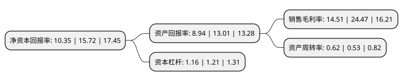

> 本页面由自动化程序生成于 2022年5月20日 01:40
> 内容可能存在错误，如有bug请提交issue至：https://github.com/Eroleice/doc-pi/issues
{.is-warning}

# 上市公司基本情况

## 基本资料

芯海科技(深圳)股份有限公司（以下简称“芯海科技”）成立于2003年09月27日，深圳市。于2020年09月28日在上交所科创板上市。

芯海科技注册资本10,000万元，专注于高精度ADC，高性能MCU，测量算法以及物联网一站式解决方案的研发设计以下是详细信息：

- 公司名称: 芯海科技(深圳)股份有限公司
- 股票代码: 688595.SH
- 所在地: 广东 - 深圳市
- 成立日期: 2003年09月27日
- 注册资本: 10,000万元
- 法定代表人: 卢国建
- 主营业务: 专注于高精度ADC，高性能MCU，测量算法以及物联网一站式解决方案的研发设计
- 公司官网: www.chipsea.com
- 公司介绍: 公司是一家集感知、计算、控制于一体的全信号链芯片设计企业，专注于高精度ADC、高性能MCU、测量算法以及物联网一站式解决方案的研发设计。采用Fabless经营模式，其芯片产品广泛应用于智慧健康、压力触控、智慧家居感知、工业测量、通用微控制器等领域,公司拥有完整的信号链芯片设计能力，核心技术为高精度的ADC技术及高可靠性MCU技术,基于对低速高精度ADC技术及高可靠性MCU技术的深刻理解，公司掌握了全信号链芯片设计技术，研制出智慧IC+智能算法、云平台、人工智能、大数据于一体的一站式服务方案，并与华为、Vivo、小米、魅族、美的、海尔、香山衡器、乐心医疗等知名终端客户建立了紧密的合作,公司在诸多方面取得显著成绩：荣获2019年第四届中国IoT技术创新奖,“优秀技术创新产品”称号等多项荣誉。

## 股东及高管情况

上市公司第一大股东为卢国建，持股28,010,325股，占比28.01%，**疑似为**上市公司实际控制人。

截至2022年04月26日，上市公司的前十大股东中，共有1名自然人股东，5名机构股东，4个产品账户，其中5%以上大股东共有2名。上市公司前十大股东明细如下：

> 未能通过持股比例判定出上市公司实际控制人（持股30%以上）
> 可能存在通过间接持股、联合持股、协议控制等方式拥有实际控制权的主体，具体请参考上市公司定期公告！
{.is-warning}

> 截至2022年04月26日，上市公司前十大股东信息如下：

| 股东名称 | 持股数量（股） | 持股比例 |
| --- | --- | --- |
| 卢国建 | 28,010,325 | 28.01% |
| 深圳市海联智合咨询顾问合伙企业(有限合伙) | 16,536,825 | 16.54% |
| 深圳市远致创业投资有限公司 | 2,756,175 | 2.76% |
| 苏州方广二期创业投资合伙企业(有限合伙) | 2,723,625 | 2.72% |
| 彬元资本有限公司-赫里福德基金-彬元大中华基金-RQFII | 2,246,121 | 2.25% |
| 西藏津盛泰达创业投资有限公司 | 2,000,000 | 2% |
| 中信证券-杭州银行-中信证券芯海科技员工参与科创板战略配售集合资产管理计划 | 1,871,700 | 1.87% |
| 深圳鸿泰基金投资管理有限公司-深圳南山鸿泰股权投资基金合伙企业(有限合伙) | 1,419,536 | 1.42% |
| 杭州亘曦资产管理有限公司-亘曦1号私募证券投资基金 | 1,340,000 | 1.34% |
| 中信证券投资有限公司 | 1,073,500 | 1.07% |

## 利润表分析

上市公司2021年总收入为6.59亿元，净利润为0.95亿元，实现盈利。

## 杜邦分析

> 数据列示周期：2021年 | 2020年 | 2019年
{.is-info}

上市公司的净资产收益率在近一年有所下降，下降幅度为-34.16%，其变化情况分解如下：
- 上市公司的销售毛利率在近一年下降了-40.7%，可能是生产效率的下降、商品原材料价格上涨或商品价格的下跌所致。
- 上市公司的资产周转率在近一年上升了16.98%，可能是源自于更快的销售回款或库存管理效果提升。
- 上市公司的财务杠杆比率在近一年下降了-4.13%，可能是减少负债降低财务费用。

