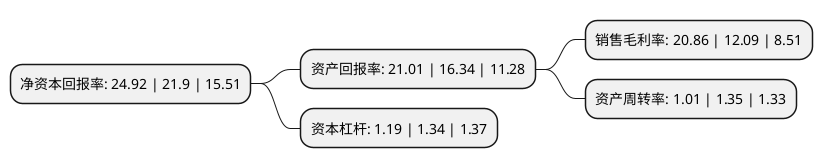

> 本页面由自动化程序生成于 2022年5月20日 01:40
> 内容可能存在错误，如有bug请提交issue至：https://github.com/Eroleice/doc-pi/issues
{.is-warning}

# 上市公司基本情况

## 基本资料

无锡力芯微电子股份有限公司（以下简称“力芯微”）成立于2002年05月28日，无锡市。于2021年06月28日在上交所科创板上市。

力芯微注册资本6,400万元，致力于模拟芯片的研发及销售，主要通过高性能，高可靠性的电源管理芯片为客户提供高效的电源管理方案，并积极研发和推广智能组网延时管理单元，信号链芯片等其他类别产品。以下是详细信息：

- 公司名称: 无锡力芯微电子股份有限公司
- 股票代码: 688601.SH
- 所在地: 江苏 - 无锡市
- 成立日期: 2002年05月28日
- 注册资本: 6,400万元
- 法定代表人: 袁敏民
- 主营业务: 致力于模拟芯片的研发及销售，主要通过高性能，高可靠性的电源管理芯片为客户提供高效的电源管理方案，并积极研发和推广智能组网延时管理单元，信号链芯片等其他类别产品
- 公司官网: www.etek.com.cn
- 公司介绍: 公司是消费电子市场主要的电源管理芯片供应商之一,致力于模拟芯片的研发及销售，主要通过高性能、高可靠性的电源管理芯片为客户提供高效的电源管理方案，并积极研发和推广智能组网延时管理单元、信号链芯片等其他类别产品,公司已经通过了多家全球知名消费电子客户严苛的认证流程，形成了包括三星、客户A、小米、LG、闻泰在内的优质终端客户群，并获得了客户的高度认可。公司采用集成电路行业典型的Fabless经营模式，专注于芯片研发及销售，晶圆制造及封装测试等生产制造环节则主要通过外部供应商进行,公司是享受国家规划布局内重点集成电路设计企业税收优惠的企业，并坚守“以市场为导向、以创新为驱动、以品质为保障”的经营理念，树立了良好的市场口碑。

## 股东及高管情况

上市公司第一大股东为无锡亿晶投资有限公司，持股27,730,000股，占比43.33%，为上市公司实际控制人。

截至2022年03月31日，上市公司的前十大股东中，共有7名机构股东，3个产品账户，其中5%以上大股东共有3名。上市公司前十大股东明细如下：

> 截至2022年03月31日，上市公司前十大股东信息如下：

| 股东名称 | 持股数量（股） | 持股比例 |
| --- | --- | --- |
| 无锡亿晶投资有限公司 | 27,730,000 | 43.33% |
| 无锡创业投资集团有限公司 | 6,120,000 | 9.56% |
| 无锡高新技术创业投资股份有限公司 | 3,880,000 | 6.06% |
| 永兴达控股集团有限公司 | 2,000,000 | 3.13% |
| 珠海横琴海捷汇富创业投资合伙企业(有限合伙) | 1,980,000 | 3.09% |
| 中芯聚源股权投资管理(上海)有限公司-上海聚源聚芯集成电路产业股权投资基金中心(有限合伙) | 1,400,000 | 2.19% |
| 华泰证券资管-中信银行-华泰力芯微家园1号科创板员工持股集合资产管理计划 | 1,270,300 | 1.98% |
| 上海淞银财富投资合伙企业(有限合伙) | 1,000,000 | 1.56% |
| 平阳温元创业投资合伙企业(有限合伙) | 970,000 | 1.52% |
| 深圳国泰君安申易一期投资基金企业(有限合伙) | 900,000 | 1.41% |

## 利润表分析

上市公司2021年总收入为7.73亿元，净利润为1.61亿元，实现盈利。

## 杜邦分析

> 数据列示周期：2021年 | 2020年 | 2019年
{.is-info}

上市公司的净资产收益率在近一年有所上升，上升幅度为13.79%，其变化情况分解如下：
- 上市公司的销售毛利率在近一年上升了72.54%，可能是生产效率的提升、商品原材料价格下跌或商品价格的上涨所致。
- 上市公司的资产周转率在近一年下降了-25.19%，可能是源自于更慢的销售回款或库存管理效果下降。
- 上市公司的财务杠杆比率在近一年下降了-11.19%，可能是减少负债降低财务费用。

