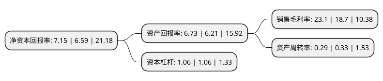

> 本页面由自动化程序生成于 2022年5月20日 01:40
> 内容可能存在错误，如有bug请提交issue至：https://github.com/Eroleice/doc-pi/issues
{.is-warning}

# 上市公司基本情况

## 基本资料

恒玄科技(上海)股份有限公司（以下简称“恒玄科技”）成立于2015年06月08日，上海市。于2020年12月16日在上交所科创板上市。

恒玄科技注册资本12,000万元，主营业务为智能音频SoC芯片的研发，设计与销售，为客户提供AIoT场景下具有语音交互能力的边缘智能主控平台芯片，产品广泛应用于智能蓝牙耳机，Type-C耳机，智能音箱等低功耗智能音频终端。以下是详细信息：

- 公司名称: 恒玄科技(上海)股份有限公司
- 股票代码: 688608.SH
- 所在地: 上海 - 上海市
- 成立日期: 2015年06月08日
- 注册资本: 12,000万元
- 法定代表人: LIANG ZHANG
- 主营业务: 主营业务为智能音频SoC芯片的研发，设计与销售，为客户提供AIoT场景下具有语音交互能力的边缘智能主控平台芯片，产品广泛应用于智能蓝牙耳机，Type-C耳机，智能音箱等低功耗智能音频终端
- 公司官网: www.bestechnic.com
- 公司介绍: 公司是国际领先的智能音频SoC芯片设计企业之一，公司已成为全球智能音频SoC芯片领域的领先供应商，产品及技术能力获得客户广泛认可，是大陆地区少数可与高通、联发科等国际巨头竞争的芯片设计公司。公司已连续两年荣获EETimes评选的中国IC设计成就奖，同时是中国电子音响行业协会理事会常务理事单位。目前公司产品已进入全球主流安卓手机品牌，包括华为、三星、OPPO、小米及Moto等，同时在专业音频厂商中也占据重要地位，进入包括哈曼、JBL、AKG、SONY、Skullcandy、万魔及漫步者等一流品牌。

## 股东及高管情况

上市公司第一大股东为Run Yuan Capital I Limited，持股13,618,865股，占比11.35%，**疑似为**上市公司实际控制人。

截至2022年03月31日，上市公司的前十大股东中，共有2名自然人股东，5名机构股东，1个产品账户，2个海外主体，其中5%以上大股东共有3名。上市公司前十大股东明细如下：

> 未能通过持股比例判定出上市公司实际控制人（持股30%以上）
> 可能存在通过间接持股、联合持股、协议控制等方式拥有实际控制权的主体，具体请参考上市公司定期公告！
{.is-warning}

> 截至2022年03月31日，上市公司前十大股东信息如下：

| 股东名称 | 持股数量（股） | 持股比例 |
| --- | --- | --- |
| Run Yuan Capital I Limited | 13,618,865 | 11.35% |
| 汤晓冬 | 13,564,784 | 11.3% |
| 赵国光 | 12,162,876 | 10.14% |
| ZHANG LIANG | 4,943,052 | 4.12% |
| 湖北小米长江产业投资基金管理有限公司-湖北小米长江产业基金合伙企业(有限合伙) | 4,191,503 | 3.49% |
| 宁波梅山保税港区万碧富创业投资合伙企业(有限合伙) | 3,931,516 | 3.28% |
| 宁波梅山保税港区百碧富企业管理合伙企业(有限合伙) | 3,908,763 | 3.26% |
| 宁波梅山保税港区千碧富企业管理合伙企业(有限合伙) | 3,531,326 | 2.94% |
| 北京集成电路设计与封测股权投资中心(有限合伙) | 3,459,084 | 2.88% |
| 阿里巴巴(中国)网络技术有限公司 | 3,353,207 | 2.79% |

## 利润表分析

上市公司2021年总收入为17.65亿元，净利润为4.07亿元，实现盈利。

## 杜邦分析

> 数据列示周期：2021年 | 2020年 | 2019年
{.is-info}

上市公司的净资产收益率在近一年有所上升，上升幅度为8.5%，其变化情况分解如下：
- 上市公司的销售毛利率在近一年上升了23.53%，可能是生产效率的提升、商品原材料价格下跌或商品价格的上涨所致。
- 上市公司的资产周转率在近一年下降了-12.12%，可能是源自于更慢的销售回款或库存管理效果下降。
- 上市公司的财务杠杆比率在近一年下降了0%，可能是减少负债降低财务费用。

