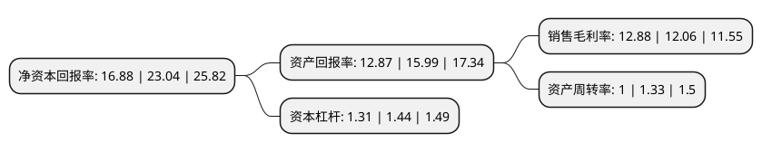

> 本页面由自动化程序生成于 2022年5月20日 01:40
> 内容可能存在错误，如有bug请提交issue至：https://github.com/Eroleice/doc-pi/issues
{.is-warning}

# 上市公司基本情况

## 基本资料

广东富信科技股份有限公司（以下简称“富信科技”）成立于2003年06月06日，佛山市。于2021年04月01日在上交所科创板上市。

富信科技注册资本8,824万元，主营业务为半导体热电器件及以其为核心的热电系统，热电整机应用产品的研发，设计，制造与销售业务。以下是详细信息：

- 公司名称: 广东富信科技股份有限公司
- 股票代码: 688662.SH
- 所在地: 广东 - 佛山市
- 成立日期: 2003年06月06日
- 注册资本: 8,824万元
- 法定代表人: 刘富林
- 主营业务: 主营业务为半导体热电器件及以其为核心的热电系统，热电整机应用产品的研发，设计，制造与销售业务
- 公司官网: www.fuxin-cn.com
- 公司介绍: 公司是一家定位于半导体热电技术解决方案提供商，主营业务为半导体热电器件及以其为核心的热电系统、热电整机应用产品的研发、设计、制造与销售业务,公司自成立以来始终以“推广半导体热电技术，为客户提供优质的产品和应用解决方案”为使命，具备全产业链技术解决方案及核心器件的独立研发制造和综合运用能力,公司所掌握的半导体热电技术是一种环保型制冷技术和绿色能源技术，能够广泛应用于消费电子、通信、医疗实验、汽车、工业、航天国防、油气采矿等众多领域。公司作为半导体热电产业高新技术企业、中国材料研究学会热电材料及应用分会理事单位，是国内外少数业务范围覆盖上游热电材料及核心器件的研制，热管理方案的设计，以及下游热电整机应用在内的全产业链技术解决方案提供商之一,公司与国内外知名电器品牌SEB、伊莱克斯、美的，日本时尚家居品牌Bruno、知名咖啡机品牌优瑞(Jura)建立了良好的合作关系；在通信领域，公司最新开发的高性能微型热电制冷器件产品已于2020年向国内知名通信基础设施提供商小批量供货。

## 股东及高管情况

上市公司第一大股东为刘富林，持股19,800,914股，占比22.44%，**疑似为**上市公司实际控制人。

截至2022年03月31日，上市公司的前十大股东中，共有3名自然人股东，6名机构股东，1个产品账户，其中5%以上大股东共有4名。上市公司前十大股东明细如下：

> 未能通过持股比例判定出上市公司实际控制人（持股30%以上）
> 可能存在通过间接持股、联合持股、协议控制等方式拥有实际控制权的主体，具体请参考上市公司定期公告！
{.is-warning}

> 截至2022年03月31日，上市公司前十大股东信息如下：

| 股东名称 | 持股数量（股） | 持股比例 |
| --- | --- | --- |
| 刘富林 | 19,800,914 | 22.44% |
| 刘富坤 | 12,951,456 | 14.68% |
| 绰丰投资有限公司 | 7,080,360 | 8.02% |
| 联升投资有限公司 | 6,288,000 | 7.13% |
| 共青城富乐投资管理合伙企业(有限合伙) | 3,300,000 | 3.74% |
| 广东弘德恒顺新材料创业投资合伙企业(有限合伙) | 3,144,000 | 3.56% |
| 中金公司-建设银行-中金新锐股票型集合资产管理计划 | 3,030,709 | 3.43% |
| 东升国际发展有限公司 | 3,018,240 | 3.42% |
| 温耀生 | 1,892,184 | 2.14% |
| 共青城地泽投资管理合伙企业(有限合伙) | 1,257,600 | 1.43% |

## 利润表分析

上市公司2021年总收入为6.96亿元，净利润为0.89亿元，实现盈利。

## 杜邦分析

> 数据列示周期：2021年 | 2020年 | 2019年
{.is-info}

上市公司的净资产收益率在近一年有所下降，下降幅度为-26.74%，其变化情况分解如下：
- 上市公司的销售毛利率在近一年上升了6.8%，可能是生产效率的提升、商品原材料价格下跌或商品价格的上涨所致。
- 上市公司的资产周转率在近一年下降了-24.81%，可能是源自于更慢的销售回款或库存管理效果下降。
- 上市公司的财务杠杆比率在近一年下降了-9.03%，可能是减少负债降低财务费用。

