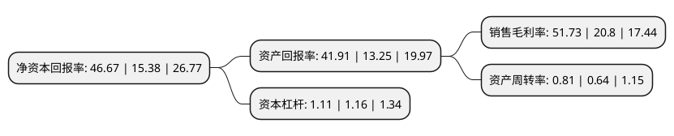

> 本页面由自动化程序生成于 2022年5月20日 01:40
> 内容可能存在错误，如有bug请提交issue至：https://github.com/Eroleice/doc-pi/issues
{.is-warning}

# 上市公司基本情况

## 基本资料

深圳市明微电子股份有限公司（以下简称“明微电子”）成立于2003年10月30日，深圳市。于2020年12月18日在上交所科创板上市。

明微电子注册资本7,436.8万元，主要从事集成电路研发设计，封装测试和销售，产品主要包括LED显示驱动芯片，LED照明驱动芯片，电源管理芯片等，产品广泛应用于LED显示屏，智能景观，照明，家电等领域。以下是详细信息：

- 公司名称: 深圳市明微电子股份有限公司
- 股票代码: 688699.SH
- 所在地: 广东 - 深圳市
- 成立日期: 2003年10月30日
- 注册资本: 7,436.8万元
- 法定代表人: 王乐康
- 主营业务: 主要从事集成电路研发设计，封装测试和销售，产品主要包括LED显示驱动芯片，LED照明驱动芯片，电源管理芯片等，产品广泛应用于LED显示屏，智能景观，照明，家电等领域
- 公司官网: www.chinaasic.com
- 公司介绍: 公司是一家主要从事集成电路研发设计、封装测试和销售的高新技术企业。公司一直专注于数模混合及模拟集成电路领域，产品主要包括LED显示驱动芯片、LED照明驱动芯片、电源管理芯片等，产品广泛应用于LED显示屏、智能景观、照明、家电等领域,公司自主研发的恒流精度控制技术、SM-PWM协议控制技术、LED状态侦测技术、消除耦合技术、OUT开关时序控制技术、消影技术、节能控制技术、高压自启动和供电技术、线性全电压驱动技术、开关调光调色技术、并联写码技术、自适应设置芯片参数技术、恒功率控制技术、多段开关控制技术、可控硅检测技术等多项技术具有显著优势，在集成电路领域竞争实力突出。公司拥有一个省级工程技术中心、一个省部级产学研基地和一个市级工程实验室，自成立以来获得了“国家知识产权优势企业”、“国家级高新技术企业”、“国家规划布局内重点集成电路设计企业”、“广东省知识产权示范企业”、“广东省知识产权优势企业”、“广东省创新型企业”、“广东省软件和集成电路设计产业百强培育企业”等荣誉。

## 股东及高管情况

上市公司第一大股东为深圳市明微技术有限公司，持股30,260,548股，占比40.69%，为上市公司实际控制人。

截至2022年03月31日，上市公司的前十大股东中，共有7名自然人股东，3名机构股东，其中5%以上大股东共有3名。上市公司前十大股东明细如下：

> 截至2022年03月31日，上市公司前十大股东信息如下：

| 股东名称 | 持股数量（股） | 持股比例 |
| --- | --- | --- |
| 深圳市明微技术有限公司 | 30,260,548 | 40.69% |
| 王乐康 | 8,731,200 | 11.74% |
| 黄学良 | 6,442,000 | 8.66% |
| 三亚红树林投资合伙企业(有限合伙) | 2,521,662 | 3.39% |
| 中信建投投资有限公司 | 929,600 | 1.25% |
| 李照华 | 828,400 | 1.11% |
| 郭王洁 | 605,600 | 0.81% |
| 王欢 | 518,888 | 0.7% |
| 马艺菲 | 496,200 | 0.67% |
| 王忠秀 | 390,000 | 0.52% |

## 利润表分析

上市公司2021年总收入为12.51亿元，净利润为6.47亿元，实现盈利。

## 杜邦分析

> 数据列示周期：2021年 | 2020年 | 2019年
{.is-info}

上市公司的净资产收益率在近一年有所上升，上升幅度为203.45%，其变化情况分解如下：
- 上市公司的销售毛利率在近一年上升了148.7%，可能是生产效率的提升、商品原材料价格下跌或商品价格的上涨所致。
- 上市公司的资产周转率在近一年上升了26.56%，可能是源自于更快的销售回款或库存管理效果提升。
- 上市公司的财务杠杆比率在近一年下降了-4.31%，可能是减少负债降低财务费用。

