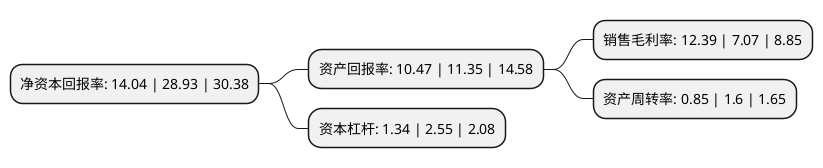

> 本页面由自动化程序生成于 2022年5月20日 01:40
> 内容可能存在错误，如有bug请提交issue至：https://github.com/Eroleice/doc-pi/issues
{.is-warning}

# 上市公司基本情况

## 基本资料

上海艾为电子技术股份有限公司（以下简称“艾为电子”）成立于2008年06月18日，上海市。于2021年08月16日在上交所科创板上市。

艾为电子注册资本16,600万元，公司主要产品包括音频功放芯片，电源管理芯片，射频前端芯片，马达驱动芯片等以下是详细信息：

- 公司名称: 上海艾为电子技术股份有限公司
- 股票代码: 688798.SH
- 所在地: 上海 - 上海市
- 成立日期: 2008年06月18日
- 注册资本: 16,600万元
- 法定代表人: 孙洪军
- 主营业务: 公司主要产品包括音频功放芯片，电源管理芯片，射频前端芯片，马达驱动芯片等
- 公司官网: www.awinic.com
- 公司介绍: 公司是一家专注于高品质数模混合信号、模拟、射频的集成电路设计企业，公司是工信部认定的集成电路设计企业、上海市科委认定的高新技术企业、上海市科技小巨人企业和上海市专精特新企业。2017年度、2018年度、2019年度，公司连续三年被知名电子信息媒体集团AspenCore评为“十大中国IC设计公司”。公司开发的音频功放芯片系列、背光驱动、呼吸灯驱动、闪光灯驱动、过压保护、GPS低噪声放大器、FM低噪声放大器、线性马达驱动等多款产品在智能手机领域处于优势地位。其中，“高压触觉反馈芯片”被AspenCore、《电子工程专辑》、《电子技术设计》、《国际电子商情》评选获得2020年度中国IC设计成就奖之年度最佳驱动芯片奖；“多级AGC智能K类音频功放”在第十四届“中国芯”集成电路大会被中国电子信息产业发展研究院评选为优秀市场表现产品；“音乐同步LED驱动SoC”被中国半导体协会、中国电子材料行业协会、中国电子专用设备工业协会和中国电子报社评选为2018年度中国半导体创新产品和技术；“电荷泵升压架构智能K类音频功放”先后被AspenCore评选为2019年度最佳功率器件和2018年度中国IC设计成就奖。

## 股东及高管情况

上市公司第一大股东为孙洪军，持股69,560,997股，占比41.9%，为上市公司实际控制人。

截至2022年03月31日，上市公司的前十大股东中，共有7名自然人股东，1名机构股东，2个产品账户，其中5%以上大股东共有3名。上市公司前十大股东明细如下：

> 截至2022年03月31日，上市公司前十大股东信息如下：

| 股东名称 | 持股数量（股） | 持股比例 |
| --- | --- | --- |
| 孙洪军 | 69,560,997 | 41.9% |
| 郭辉 | 16,200,000 | 9.76% |
| 上海艾准企业管理中心(有限合伙) | 10,251,003 | 6.18% |
| 程剑涛 | 6,534,000 | 3.94% |
| 张忠 | 5,400,000 | 3.25% |
| 娄声波 | 5,086,800 | 3.06% |
| 杜黎明 | 3,458,700 | 2.08% |
| 中信证券-中信银行-中信证券艾为电子员工参与科创板战略配售集合资产管理计划 | 3,202,000 | 1.93% |
| 交通银行股份有限公司-万家行业优选混合型证券投资基金(LOF) | 2,832,300 | 1.71% |
| 牟韬 | 1,890,000 | 1.14% |

## 利润表分析

上市公司2021年总收入为23.27亿元，净利润为2.88亿元，实现盈利。

## 杜邦分析

> 数据列示周期：2021年 | 2020年 | 2019年
{.is-info}

上市公司的净资产收益率在近一年有所下降，下降幅度为-51.47%，其变化情况分解如下：
- 上市公司的销售毛利率在近一年上升了75.25%，可能是生产效率的提升、商品原材料价格下跌或商品价格的上涨所致。
- 上市公司的资产周转率在近一年下降了-46.87%，可能是源自于更慢的销售回款或库存管理效果下降。
- 上市公司的财务杠杆比率在近一年下降了-47.45%，可能是减少负债降低财务费用。

