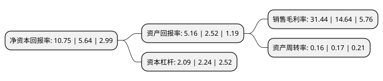

> 本页面由自动化程序生成于 2022年5月20日 01:40
> 内容可能存在错误，如有bug请提交issue至：https://github.com/Eroleice/doc-pi/issues
{.is-warning}

# 上市公司基本情况

## 基本资料

中芯国际集成电路制造有限公司（以下简称“中芯国际”）成立于2000年04月03日，null。于2020年07月16日在上交所科创板上市。

中芯国际注册资本790,405.131万元，主要为客户提供0。35微米至14纳米多种技术节点，不同工艺平台的集成电路晶圆代工及配套服务以下是详细信息：

- 公司名称: 中芯国际集成电路制造有限公司
- 股票代码: 688981.SH
- 所在地: null - null
- 成立日期: 2000年04月03日
- 注册资本: 790,405.131万元
- 法定代表人: 高永岗
- 主营业务: 主要为客户提供035微米至14纳米多种技术节点，不同工艺平台的集成电路晶圆代工及配套服务
- 公司官网: www.smics.com
- 公司介绍: 公司是全球领先的集成电路晶圆代工企业之一，也是中国大陆技术最先进、规模最大、配套服务最完善、跨国经营的专业晶圆代工企业，主要为客户提供0.35微米至14纳米多种技术节点、不同工艺平台的集成电路晶圆代工及配套服务,在逻辑工艺领域，中芯国际是中国大陆第一家实现14纳米FinFET量产的晶圆代工企业，代表中国大陆自主研发集成电路制造技术的最先进水平；在特色工艺领域，中芯国际陆续推出中国大陆最先进的24纳米NAND、40纳米高性能图像传感器等特色工艺，与各领域的龙头公司合作，实现在特殊存储器、高性能图像传感器等细分市场的持续增长,除集成电路晶圆代工业务外，中芯国际亦致力于打造平台式的生态服务模式，为客户提供设计服务与IP支持、光掩模制造、凸块加工及测试等一站式配套服务，并促进集成电路产业链的上下游合作，与产业链各环节的合作伙伴一同为客户提供全方位的集成电路解决方案。

## 股东及高管情况

上市公司第一大股东为香港中央结算(代理人)有限公司，持股4,485,295,591股，占比56.73%，为上市公司实际控制人。

截至2022年03月31日，上市公司的前十大股东中，共有5名机构股东，3个产品账户，2个海外主体，其中5%以上大股东共有3名。上市公司前十大股东明细如下：

> 截至2022年03月31日，上市公司前十大股东信息如下：

| 股东名称 | 持股数量（股） | 持股比例 |
| --- | --- | --- |
| 香港中央结算(代理人)有限公司 | 4,485,295,591 | 56.73% |
| 大唐控股(香港)投资有限公司 | 852,522,595 | 10.78% |
| 鑫芯(香港)投资有限公司 | 617,214,804 | 7.81% |
| 国家集成电路产业投资基金二期股份有限公司 | 127,458,120 | 1.61% |
| 中国信息通信科技集团有限公司 | 72,470,855 | 0.92% |
| GIC PRIVATE LIMITED | 70,939,287 | 0.9% |
| 招商银行股份有限公司-华夏上证科创板50成份交易型开放式指数证券投资基金 | 45,090,835 | 0.57% |
| 青岛聚源芯星股权投资合伙企业(有限合伙) | 39,488,205 | 0.5% |
| 国新投资有限公司 | 36,416,605 | 0.46% |
| 中国工商银行股份有限公司-诺安成长股票型证券投资基金 | 32,227,993 | 0.41% |

## 利润表分析

上市公司2021年总收入为356.3亿元，净利润为112.02亿元，实现盈利。

## 杜邦分析

> 数据列示周期：2021年 | 2020年 | 2019年
{.is-info}

上市公司的净资产收益率在近一年有所上升，上升幅度为90.6%，其变化情况分解如下：
- 上市公司的销售毛利率在近一年上升了114.75%，可能是生产效率的提升、商品原材料价格下跌或商品价格的上涨所致。
- 上市公司的资产周转率在近一年下降了-5.88%，可能是源自于更慢的销售回款或库存管理效果下降。
- 上市公司的财务杠杆比率在近一年下降了-6.7%，可能是减少负债降低财务费用。

