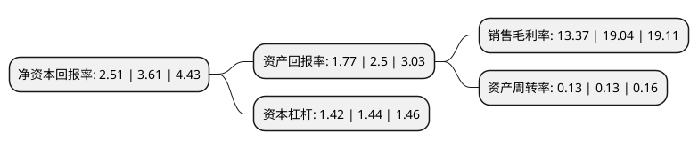

> 本页面由自动化程序生成于 2022年5月20日 01:08
> 内容可能存在错误，如有bug请提交issue至：https://github.com/Eroleice/doc-pi/issues
{.is-warning}

# 上市公司基本情况

## 基本资料

海宁中国皮革城股份有限公司（以下简称“海宁皮城”）成立于1999年02月25日，嘉兴市。于2010年01月26日在深交所中小板上市。

海宁皮城注册资本128,261.696万元，主营业务:皮革专业市场的开发，租赁和服务以下是详细信息：

- 公司名称: 海宁中国皮革城股份有限公司
- 股票代码: 002344.SZ
- 所在地: 浙江 - 嘉兴市
- 成立日期: 1999年02月25日
- 注册资本: 128,261.696万元
- 法定代表人: 张月明
- 主营业务: 主营业务:皮革专业市场的开发，租赁和服务
- 公司官网: www.zgpgc.com
- 公司介绍: 公司是一家集商贸、金融、信息服务等为一体的全国领先的皮革专业市场，商品交易额位居全国皮革专业市场领先，是华东地区最大的箱包交易区之一，市场内的革皮服装交易辐射全国和海外市场。公司主要从事“海宁中国皮革城”市场商铺及配套物业的销售、租赁，始终致力于整合皮革产业价值链的上下游，在皮革制品生产、营销和交易等环节。海宁皮革产业集群已形成了以皮革服装、沙发套和成品沙发、制革为主体，以皮革票夹、皮革化工、箱包及五金配件和皮革手套等小制品为辅的较为完整的产业体系。

## 股东及高管情况

上市公司第一大股东为海宁市资产经营公司，持股443,581,267股，占比34.58%，为上市公司实际控制人。

截至2022年03月31日，上市公司的前十大股东中，共有2名自然人股东，4名机构股东，3个产品账户，1个海外主体，其中5%以上大股东共有2名。上市公司前十大股东明细如下：

> 截至2022年03月31日，上市公司前十大股东信息如下：

| 股东名称 | 持股数量（股） | 持股比例 |
| --- | --- | --- |
| 海宁市资产经营公司 | 443,581,267 | 34.58% |
| 海宁市市场开发服务中心有限公司 | 235,538,800 | 18.36% |
| 宏达高科控股股份有限公司 | 30,200,000 | 2.35% |
| 云南国际信托有限公司-云南信托·大西部丝绸之路2号集合资金信托计划 | 12,508,691 | 0.98% |
| 林文娟 | 6,785,129 | 0.53% |
| MERRILL LYNCH INTERNATIONAL | 6,320,550 | 0.49% |
| 海宁中国皮革城股份有限公司-第一期员工持股计划 | 6,000,000 | 0.47% |
| 张富平 | 5,371,300 | 0.42% |
| 云南国际信托有限公司-云南信托·大西部丝绸之路1号集合资金信托计划 | 4,672,897 | 0.36% |
| 兴业财富资产-兴业银行-江西中文传媒蓝海国际投资有限公司 | 4,672,897 | 0.36% |

## 利润表分析

上市公司2021年总收入为14.55亿元，净利润为3.3亿元，实现盈利。

## 杜邦分析

> 数据列示周期：2020年 | 2019年 | 2018年
{.is-info}

上市公司的净资产收益率在近一年有所下降，下降幅度为-30.47%，其变化情况分解如下：
- 上市公司的销售毛利率在近一年下降了-29.78%，可能是生产效率的下降、商品原材料价格上涨或商品价格的下跌所致。
- 上市公司的资产周转率在近一年下降了0%，可能是源自于更慢的销售回款或库存管理效果下降。
- 上市公司的财务杠杆比率在近一年下降了-1.39%，可能是减少负债降低财务费用。

