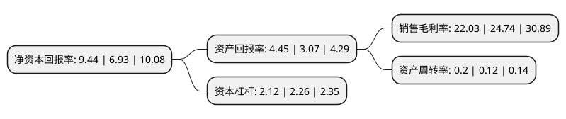

> 本页面由自动化程序生成于 2022年5月20日 01:26
> 内容可能存在错误，如有bug请提交issue至：https://github.com/Eroleice/doc-pi/issues
{.is-warning}

# 上市公司基本情况

## 基本资料

浙江中国小商品城集团股份有限公司（以下简称“小商品城”）成立于1993年12月28日，金华市。于2002年05月09日在上交所主板上市。

小商品城注册资本549,127.418万元，主营业务:市场网点经营，酒店服务，商品销售，房地产开发销售等。以下是详细信息：

- 公司名称: 浙江中国小商品城集团股份有限公司
- 股票代码: 600415.SH
- 所在地: 浙江 - 金华市
- 成立日期: 1993年12月28日
- 注册资本: 549,127.418万元
- 法定代表人: 赵文阁
- 主营业务: 主营业务:市场网点经营，酒店服务，商品销售，房地产开发销售等
- 公司官网: www.cccgroup.com.cn
- 公司介绍: 公司是目前我国最大的专业批发市场的发展商之一，以独家经营开发、管理、服务义乌中国小商品城为主业，产品几乎囊括了工艺品、小五金、日用百货、纺织品、服装等所有日用工业品，辐射多个国家和地区，是我国小商品的流通、研发、展示中心和重要出口基地之一。一直以来，公司以服务全球中小微企业为宗旨，搭建共享式贸易服务平台。依托小商品城优越的商业环境和得天独厚的市场资源，公司以独家经营开发、管理、服务市场为主业，并大力发展电子商务、国际贸易、房地产、会展、酒店、物流、广告等相关行业，形成市场资源共享与联动发展的集团架构和盈利模式。

## 股东及高管情况

上市公司第一大股东为义乌中国小商品城控股有限责任公司，持股3,038,179,392股，占比55.33%，为上市公司实际控制人。

截至2022年03月31日，上市公司的前十大股东中，共有2名机构股东，7个产品账户，1个海外主体，其中5%以上大股东共有1名。上市公司前十大股东明细如下：

> 截至2022年03月31日，上市公司前十大股东信息如下：

| 股东名称 | 持股数量（股） | 持股比例 |
| --- | --- | --- |
| 义乌中国小商品城控股有限责任公司 | 3,038,179,392 | 55.33% |
| 浙江省财务开发有限责任公司 | 147,466,528 | 2.69% |
| 香港中央结算有限公司(陆股通) | 66,146,374 | 1.2% |
| 广发基金-农业银行-广发中证金融资产管理计划 | 27,672,800 | 0.5% |
| 南方基金-农业银行-南方中证金融资产管理计划 | 27,672,800 | 0.5% |
| 大成基金-农业银行-大成中证金融资产管理计划 | 27,672,800 | 0.5% |
| 工银瑞信基金-农业银行-工银瑞信中证金融资产管理计划 | 27,672,800 | 0.5% |
| 中欧基金-农业银行-中欧中证金融资产管理计划 | 27,672,800 | 0.5% |
| 博时基金-农业银行-博时中证金融资产管理计划 | 27,672,800 | 0.5% |
| 易方达基金-农业银行-易方达中证金融资产管理计划 | 27,672,800 | 0.5% |

## 利润表分析

上市公司2021年总收入为60.33亿元，净利润为13.29亿元，实现盈利。

## 杜邦分析

> 数据列示周期：2021年 | 2020年 | 2019年
{.is-info}

上市公司的净资产收益率在近一年有所上升，上升幅度为36.22%，其变化情况分解如下：
- 上市公司的销售毛利率在近一年下降了-10.95%，可能是生产效率的下降、商品原材料价格上涨或商品价格的下跌所致。
- 上市公司的资产周转率在近一年上升了66.67%，可能是源自于更快的销售回款或库存管理效果提升。
- 上市公司的财务杠杆比率在近一年下降了-6.19%，可能是减少负债降低财务费用。

