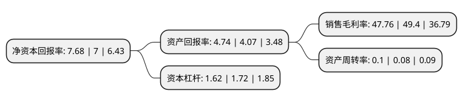

> 本页面由自动化程序生成于 2022年5月20日 01:29
> 内容可能存在错误，如有bug请提交issue至：https://github.com/Eroleice/doc-pi/issues
{.is-warning}

# 上市公司基本情况

## 基本资料

浙江中国轻纺城集团股份有限公司（以下简称“轻纺城”）成立于1993年04月26日，绍兴市。于1997年02月28日在上交所主板上市。

轻纺城注册资本146,579.093万元，纺织品销售及加工，市场租赁，酒类销售，建材销售。以下是详细信息：

- 公司名称: 浙江中国轻纺城集团股份有限公司
- 股票代码: 600790.SH
- 所在地: 浙江 - 绍兴市
- 成立日期: 1993年04月26日
- 注册资本: 146,579.093万元
- 法定代表人: 潘建华
- 主营业务: 纺织品销售及加工，市场租赁，酒类销售，建材销售
- 公司官网: www.qfcgroup.com
- 公司介绍: 公司以中国轻纺城营业用房的开发、租赁和物业管理为主业，集市场、物流、担保于一体。其中，市场主业主要拥有中国轻纺城东市场、老市场、北交易区、联合市场、天汇广场、服装市场、北联市场、东升路市场等专业批发市场，中国轻纺城市场先后荣获“全国诚信市场”、“全国重点市场”、“全国文明市场”、“中国十强品牌市场”等称号；绍兴县中国轻纺城国际物流中心是一个集仓储、运输、包装、理货、停车、货运信息等系列功能于一体的现代化综合性物流站场，系“国家4A级综合服务型物流企业”、“中国物流企业50强”、“浙江省50家现代物流重点联系企业”；中轻担保主要为中小企业、个体工商户及个人提供信用担保服务，主要包括融资贷款担保、工程履约担保、诉讼保全担保、出口信用担保等，系“中小企业信用担保A级”企业。

## 股东及高管情况

上市公司第一大股东为绍兴市柯桥区开发经营集团有限公司，持股553,362,648股，占比37.75%，为上市公司实际控制人。

截至2022年03月31日，上市公司的前十大股东中，共有6名自然人股东，3名机构股东，1名其他股东，其中5%以上大股东共有1名。上市公司前十大股东明细如下：

> 截至2022年03月31日，上市公司前十大股东信息如下：

| 股东名称 | 持股数量（股） | 持股比例 |
| --- | --- | --- |
| 绍兴市柯桥区开发经营集团有限公司 | 553,362,648 | 37.75% |
| 浙江精功控股有限公司 | 63,700,000 | 4.35% |
| 浙江省财务开发有限责任公司 | 24,427,966 | 1.67% |
| 张方正 | 18,998,800 | 1.3% |
| 绍兴市柯桥区柯桥街道红建股份经济合作社 | 10,738,000 | 0.73% |
| 李俊 | 9,900,028 | 0.68% |
| 陈秀英 | 9,060,870 | 0.62% |
| 龚万伦 | 8,239,172 | 0.56% |
| 龚岚 | 7,772,756 | 0.53% |
| 程开武 | 6,046,258 | 0.41% |

## 利润表分析

上市公司2021年总收入为9.27亿元，净利润为4.42亿元，实现盈利。

## 杜邦分析

> 数据列示周期：2021年 | 2020年 | 2019年
{.is-info}

上市公司的净资产收益率在近一年有所上升，上升幅度为9.71%，其变化情况分解如下：
- 上市公司的销售毛利率在近一年下降了-3.32%，可能是生产效率的下降、商品原材料价格上涨或商品价格的下跌所致。
- 上市公司的资产周转率在近一年上升了25%，可能是源自于更快的销售回款或库存管理效果提升。
- 上市公司的财务杠杆比率在近一年下降了-5.81%，可能是减少负债降低财务费用。

