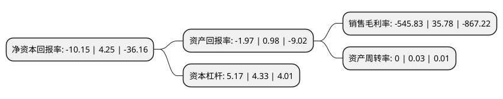

> 本页面由自动化程序生成于 2022年5月20日 01:02
> 内容可能存在错误，如有bug请提交issue至：https://github.com/Eroleice/doc-pi/issues
{.is-warning}

# 上市公司基本情况

## 基本资料

内蒙古天首科技发展股份有限公司（以下简称“*ST天首”）成立于1996年09月27日，包头市。于1996年10月08日在深交所主板上市。

*ST天首注册资本33,782.202万元，主营业务:以生产和销售纺织产品为主业以下是详细信息：

- 公司名称: 内蒙古天首科技发展股份有限公司
- 股票代码: 000611.SZ
- 所在地: 内蒙古 - 包头市
- 成立日期: 1996年09月27日
- 注册资本: 33,782.202万元
- 法定代表人: 邱士杰
- 主营业务: 主营业务:以生产和销售纺织产品为主业
- 公司官网: www.timegroup.com.cn
- 公司介绍: 公司主营业务为纺织业务、租赁业务和贸易业务。公司纺织业务主要为涤纶布的生产和氨纶丝的销售，华东地区和华南地区的业务主要为纺织业务，公司通过提升销售力度，使得公司营业收入不断增长。为了公司的持续发展以及避免同业竞争，公司相关资源，在华北、西北和华中地区开展了大宗商品贸易业务。同时，公司开展了黑色金属和有色金属业务。在未来，随着公司贸易业务的进一步开展，将来可能在贸易行业的客户资源、风险控制方面形成公司新的核心竞争力。

## 股东及高管情况

上市公司第一大股东为周仁瑀，持股13,852,033股，占比4.1%，**疑似为**上市公司实际控制人。

截至2022年03月31日，上市公司的前十大股东中，共有10名自然人股东。上市公司前十大股东明细如下：

> 未能通过持股比例判定出上市公司实际控制人（持股30%以上）
> 可能存在通过间接持股、联合持股、协议控制等方式拥有实际控制权的主体，具体请参考上市公司定期公告！
{.is-warning}

> 上市公司第一大股东持股不超过10%，请检查是否存在公司控制权风险！
{.is-danger}

> 截至2022年03月31日，上市公司前十大股东信息如下：

| 股东名称 | 持股数量（股） | 持股比例 |
| --- | --- | --- |
| 周仁瑀 | 13,852,033 | 4.1% |
| 张祥林 | 9,514,700 | 2.82% |
| 邱敏君 | 5,380,563 | 1.59% |
| 改宏业 | 5,001,085 | 1.48% |
| 蔡莉萍 | 4,703,038 | 1.39% |
| 胡祖平 | 4,191,100 | 1.24% |
| 张戈 | 4,017,200 | 1.19% |
| 徐莉蓉 | 3,732,600 | 1.1% |
| 周林松 | 3,245,300 | 0.96% |
| 林树林 | 3,207,300 | 0.95% |

## 利润表分析

上市公司2021年总收入为1.32亿元，净利润为-0.33亿元，**未实现盈利**。

## 杜邦分析

> 数据列示周期：2020年 | 2019年 | 2018年
{.is-info}

上市公司的净资产收益率在近一年有所下降，下降幅度为-338.82%，其变化情况分解如下：
- 上市公司的销售毛利率在近一年下降了-1625.52%，可能是生产效率的下降、商品原材料价格上涨或商品价格的下跌所致。
- 上市公司的资产周转率在近一年下降了-100%，可能是源自于更慢的销售回款或库存管理效果下降。
- 上市公司的财务杠杆比率在近一年上升了19.4%，可能是增加负债扩大生产规模。

