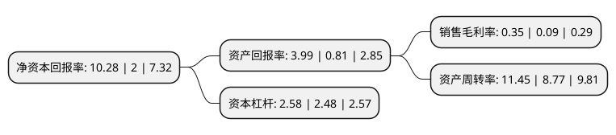

> 本页面由自动化程序生成于 2022年5月20日 01:02
> 内容可能存在错误，如有bug请提交issue至：https://github.com/Eroleice/doc-pi/issues
{.is-warning}

# 上市公司基本情况

## 基本资料

远大产业控股股份有限公司（以下简称“远大控股”）成立于1994年06月27日，连云港市。于1996年11月28日在深交所主板上市。

远大控股注册资本50,894.046万元，批发和零售贸易业务以下是详细信息：

- 公司名称: 远大产业控股股份有限公司
- 股票代码: 000626.SZ
- 所在地: 江苏 - 连云港市
- 成立日期: 1994年06月27日
- 注册资本: 50,894.046万元
- 法定代表人: 史迎春
- 主营业务: 批发和零售贸易业务
- 公司官网: www.grand-holding.cn
- 公司介绍: 公司是一家以大宗商品贸易为主营的企业，经营主体为全资子公司远大物产集团有限公司。远大物产主营石油化工、能源化工、金属、农产品等大宗商品贸易，经过多年的发展，已经从传统的现货贸易商发展成为大宗商品交易商，即以大宗商品现货为基础，以期货工具为手段，通过期现货有效结合，规避现货市场的价格风险，增强客户粘性，拓展销售渠道，服务实体经济，并为上下游产业链提供价值服务，获取商业利润。远大物产连续入围中国企业500强。

## 股东及高管情况

上市公司第一大股东为中国远大集团有限责任公司，持股209,522,100股，占比41.17%，为上市公司实际控制人。

截至2022年04月15日，上市公司的前十大股东中，共有5名自然人股东，3名机构股东，1个产品账户，1个海外主体，其中5%以上大股东共有2名。上市公司前十大股东明细如下：

> 截至2022年04月15日，上市公司前十大股东信息如下：

| 股东名称 | 持股数量（股） | 持股比例 |
| --- | --- | --- |
| 中国远大集团有限责任公司 | 209,522,100 | 41.17% |
| 连云港金控资本管理有限公司 | 82,072,000 | 16.13% |
| 金波 | 6,818,381 | 1.34% |
| 宁波至正投资管理有限公司 | 5,750,253 | 1.13% |
| 马敏 | 4,519,175 | 0.89% |
| 朱培元 | 4,354,600 | 0.86% |
| 上海毓璜投资管理有限公司-毓璜亿保丰壹號私募证券投资基金 | 4,087,400 | 0.8% |
| 许强 | 3,340,457 | 0.66% |
| 香港中央结算有限公司(陆股通) | 3,297,792 | 0.65% |
| 吴向东 | 3,100,000 | 0.61% |

## 利润表分析

上市公司2021年总收入为815.61亿元，净利润为2.83亿元，实现盈利。

## 杜邦分析

> 数据列示周期：2021年 | 2020年 | 2019年
{.is-info}

上市公司的净资产收益率在近一年有所上升，上升幅度为414%，其变化情况分解如下：
- 上市公司的销售毛利率在近一年上升了288.89%，可能是生产效率的提升、商品原材料价格下跌或商品价格的上涨所致。
- 上市公司的资产周转率在近一年上升了30.56%，可能是源自于更快的销售回款或库存管理效果提升。
- 上市公司的财务杠杆比率在近一年上升了4.03%，可能是增加负债扩大生产规模。

