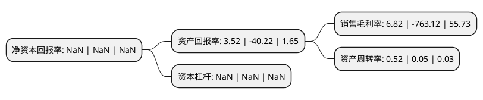

> 本页面由自动化程序生成于 2022年5月20日 01:05
> 内容可能存在错误，如有bug请提交issue至：https://github.com/Eroleice/doc-pi/issues
{.is-warning}

# 上市公司基本情况

## 基本资料

凯瑞德控股股份有限公司（以下简称“*ST凯瑞”）成立于2000年06月12日，荆门市。于2006年10月18日在深交所中小板上市。

*ST凯瑞注册资本36,768万元，主营业务是向客户提供互联网出口带宽优化服务和互联网应用加速服务。以下是详细信息：

- 公司名称: 凯瑞德控股股份有限公司
- 股票代码: 002072.SZ
- 所在地: 湖北 - 荆门市
- 成立日期: 2000年06月12日
- 注册资本: 36,768万元
- 法定代表人: 李燕媚
- 主营业务: 主营业务是向客户提供互联网出口带宽优化服务和互联网应用加速服务
- 公司官网: www.002072krd.com
- 公司介绍: 公司原是一家大型棉纺织企业，也是国内高档装饰面料和服装面料的主要生产商。2016年,原纺织类资产基本交割完成，公司完成北京屹立由数据有限公司的股权过户手续，公司主业由原来的纺织主业变更成为互联网加速服务相关业务。北京屹立由数据有限公司目前的主营业务是向客户提供互联网出口带宽优化服务和互联网应用加速服务。主要客户包括中国移动及中国铁通的省级和地市级分公司、广电网络的省级及地市级企业，以及网络游戏运营商、网络视频运营商等。为了服务广大的客户，研发了一系列软件并搭建一个覆盖全国20多个省市自治区的网络优化平台，该平台在30多个城市拥有服务节点。

## 股东及高管情况

上市公司第一大股东为凯瑞德控股股份有限公司破产企业财产处置专用账户，持股78,336,781股，占比21.31%，**疑似为**上市公司实际控制人。

截至2022年03月31日，上市公司的前十大股东中，共有6名自然人股东，3名机构股东，1个产品账户，其中5%以上大股东共有3名。上市公司前十大股东明细如下：

> 未能通过持股比例判定出上市公司实际控制人（持股30%以上）
> 可能存在通过间接持股、联合持股、协议控制等方式拥有实际控制权的主体，具体请参考上市公司定期公告！
{.is-warning}

> 截至2022年03月31日，上市公司前十大股东信息如下：

| 股东名称 | 持股数量（股） | 持股比例 |
| --- | --- | --- |
| 凯瑞德控股股份有限公司破产企业财产处置专用账户 | 78,336,781 | 21.31% |
| 王健 | 69,894,600 | 19.01% |
| 湖北农谷实业集团有限责任公司 | 34,900,000 | 9.49% |
| 杭州东艮佳善投资管理合伙企业(有限合伙) | 10,806,278 | 2.94% |
| 毕经祥 | 8,586,300 | 2.34% |
| 保成鼎盛国际贸易(北京)有限公司 | 5,280,000 | 1.44% |
| 王晶 | 4,758,378 | 1.29% |
| 刘世青 | 4,421,100 | 1.2% |
| 赵睿 | 3,813,000 | 1.04% |
| 严琳 | 3,664,455 | 1% |

## 利润表分析

上市公司2021年总收入为1.27亿元，净利润为0.08亿元，实现盈利。

## 杜邦分析

> 数据列示周期：2021年 | 2020年 | 2019年
{.is-info}

上市公司的净资产收益率在近一年有所下降，下降幅度为NaN%，其变化情况分解如下：
- 上市公司的销售毛利率在近一年下降了-100.89%，可能是生产效率的下降、商品原材料价格上涨或商品价格的下跌所致。
- 上市公司的资产周转率在近一年上升了940%，可能是源自于更快的销售回款或库存管理效果提升。
- 上市公司的财务杠杆比率在近一年下降了NaN%，可能是减少负债降低财务费用。

