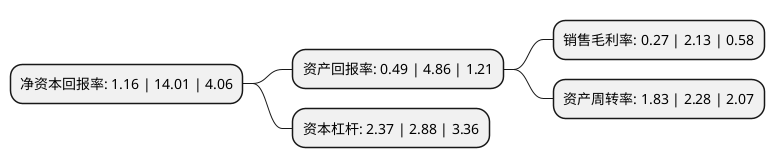

> 本页面由自动化程序生成于 2022年5月20日 01:15
> 内容可能存在错误，如有bug请提交issue至：https://github.com/Eroleice/doc-pi/issues
{.is-warning}

# 上市公司基本情况

## 基本资料

深圳市英唐智能控制股份有限公司（以下简称“英唐智控”）成立于2001年07月06日，深圳市。于2010年10月19日在深交所创业板上市。

英唐智控注册资本106,952.643万元，主营业务是以数码娱乐类生活电器智能控制产品的生产及国内销售为主，兼营家居，厨卫，个人护理小型生活电器智能控制产品的生产和直接出口业务。主要产品有发钳电子智能控制器，咖啡壶电子智能控制器，风筒电子智能控制器，媒体播放器电子智能控制器等。以下是详细信息：

- 公司名称: 深圳市英唐智能控制股份有限公司
- 股票代码: 300131.SZ
- 所在地: 广东 - 深圳市
- 成立日期: 2001年07月06日
- 注册资本: 106,952.643万元
- 法定代表人: 胡庆周
- 主营业务: 主营业务是以数码娱乐类生活电器智能控制产品的生产及国内销售为主，兼营家居，厨卫，个人护理小型生活电器智能控制产品的生产和直接出口业务主要产品有发钳电子智能控制器，咖啡壶电子智能控制器，风筒电子智能控制器，媒体播放器电子智能控制器等
- 公司官网: www.yitoa.com
- 公司介绍: 公司是国内小型生活电器智能控制器领域的龙头企业，致力于小型生活电器的智能化服务，向客户提供先进的智能化思想和设计方案、智能控制软件开发、产品设计、样品制作、批量供货等全流程服务。公司形成了以智能控制及电子元器件分销为基础，并逐步建立智能家居(家庭数据)平台和电子信息产业互联网(企业数据)平台的双平台。公司拥有多项专利，先后获得“深圳市高新技术企业”、“深圳市软件百强企业”、“深圳市软件出口二十强企业”、“诚信中小企业”及“高新技术企业”等称号。

## 股东及高管情况

上市公司第一大股东为胡庆周，持股159,967,455股，占比14.96%，**疑似为**上市公司实际控制人。

截至2022年03月31日，上市公司的前十大股东中，共有7名自然人股东，2个产品账户，1个海外主体，其中5%以上大股东共有1名。上市公司前十大股东明细如下：

> 未能通过持股比例判定出上市公司实际控制人（持股30%以上）
> 可能存在通过间接持股、联合持股、协议控制等方式拥有实际控制权的主体，具体请参考上市公司定期公告！
{.is-warning}

> 截至2022年03月31日，上市公司前十大股东信息如下：

| 股东名称 | 持股数量（股） | 持股比例 |
| --- | --- | --- |
| 胡庆周 | 159,967,455 | 14.96% |
| 甘礼清 | 17,950,000 | 1.68% |
| 珠海阿巴马资产管理有限公司-阿巴马元享红利112号私募证券投资基金 | 11,791,000 | 1.1% |
| 珠海阿巴马资产管理有限公司-阿巴马元享红利125号私募证券投资基金 | 9,599,000 | 0.9% |
| 吕强 | 7,298,800 | 0.68% |
| 向上 | 7,000,000 | 0.65% |
| 彭旭 | 5,889,457 | 0.55% |
| 王桂萍 | 5,261,968 | 0.49% |
| 黄亚丹 | 4,865,068 | 0.45% |
| 香港中央结算有限公司(陆股通) | 4,286,606 | 0.4% |

## 利润表分析

上市公司2021年总收入为63.38亿元，净利润为0.16亿元，实现盈利。

## 杜邦分析

> 数据列示周期：2021年 | 2020年 | 2019年
{.is-info}

上市公司的净资产收益率在近一年有所下降，下降幅度为-91.72%，其变化情况分解如下：
- 上市公司的销售毛利率在近一年下降了-87.32%，可能是生产效率的下降、商品原材料价格上涨或商品价格的下跌所致。
- 上市公司的资产周转率在近一年下降了-19.74%，可能是源自于更慢的销售回款或库存管理效果下降。
- 上市公司的财务杠杆比率在近一年下降了-17.71%，可能是减少负债降低财务费用。

