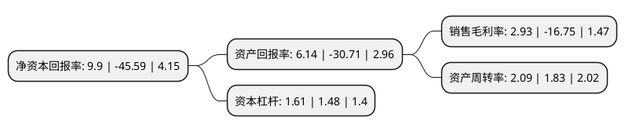

> 本页面由自动化程序生成于 2022年5月20日 01:15
> 内容可能存在错误，如有bug请提交issue至：https://github.com/Eroleice/doc-pi/issues
{.is-warning}

# 上市公司基本情况

## 基本资料

武汉力源信息技术股份有限公司（以下简称“力源信息”）成立于2001年08月09日，武汉市。于2011年02月22日在深交所创业板上市。

力源信息注册资本116,468.192万元，主营业务为半导体集成电路(Integrated Circuit，简称“IC”)等电子元器件的推广，销售及应用服务。主要产品为IC，分立半导体器件，被动无源器件。以下是详细信息：

- 公司名称: 武汉力源信息技术股份有限公司
- 股票代码: 300184.SZ
- 所在地: 湖北 - 武汉市
- 成立日期: 2001年08月09日
- 注册资本: 116,468.192万元
- 法定代表人: 赵马克
- 主营业务: 主营业务为半导体集成电路(Integrated Circuit，简称“IC”)等电子元器件的推广，销售及应用服务主要产品为IC，分立半导体器件，被动无源器件
- 公司官网: www.icbase.com
- 公司介绍: 公司是国内著名的电子元器件代理及分销商、方案商，中国IC分销行业的领航者。公司自设立以来主要从事IC等电子元器件的推广、销售及应用服务，是推广IC新产品、传递IC新技术、整合IC市场供求信息的重要平台，也是IC产业链中联接上游生产商和下游用户的重要纽带。公司是以电子制造企业为主要目标客户，针对客户的不同需求，向客户提供包括产品资料、产品选型、免费样品、产品研发、方案设计、技术支持、供应保障等多元化服务。代理的产品线既有以意法半导体、安森美半导体、AICC为代表的欧美系产品线，又有以华为海思、瑞迪科、思威特、泰斗为代表的国产系产品线，以及以瑞萨、村田、欧姆龙、罗姆和索尼为代表的日系产品线。产品覆盖主动及被动电子元器件，服务客户覆盖家电、手机、汽车电子、金融电子、电力电子、医疗电子、仪器仪表、工业控制、安防监控、智能穿戴、智能家居、能源互联网、IPTV/OTT、充电桩等领域。

## 股东及高管情况

上市公司第一大股东为MARK ZHAO，持股137,357,108股，占比11.79%，**疑似为**上市公司实际控制人。

截至2022年03月31日，上市公司的前十大股东中，共有4名自然人股东，3名机构股东，2个产品账户，1个海外主体，其中5%以上大股东共有2名。上市公司前十大股东明细如下：

> 未能通过持股比例判定出上市公司实际控制人（持股30%以上）
> 可能存在通过间接持股、联合持股、协议控制等方式拥有实际控制权的主体，具体请参考上市公司定期公告！
{.is-warning}

> 截至2022年03月31日，上市公司前十大股东信息如下：

| 股东名称 | 持股数量（股） | 持股比例 |
| --- | --- | --- |
| MARK ZHAO | 137,357,108 | 11.79% |
| 赵佳生 | 64,170,109 | 5.51% |
| 华夏人寿保险股份有限公司-万能产品 | 34,828,291 | 2.99% |
| 青岛清芯民和投资中心(有限合伙) | 20,367,407 | 1.75% |
| 北京海厚泰资本管理有限公司-海厚泰契约型私募基金陆号 | 16,949,787 | 1.46% |
| 高惠谊 | 13,286,759 | 1.14% |
| 乌鲁木齐融冰股权投资合伙企业(有限合伙) | 12,887,069 | 1.11% |
| 李文俊 | 10,644,215 | 0.91% |
| 南京丰同投资中心(有限合伙) | 9,491,439 | 0.81% |
| 陈士本 | 5,955,000 | 0.51% |

## 利润表分析

上市公司2021年总收入为104.42亿元，净利润为3.06亿元，实现盈利。

## 杜邦分析

> 数据列示周期：2021年 | 2020年 | 2019年
{.is-info}

上市公司的净资产收益率在近一年有所下降，下降幅度为-121.72%，其变化情况分解如下：
- 上市公司的销售毛利率在近一年下降了-117.49%，可能是生产效率的下降、商品原材料价格上涨或商品价格的下跌所致。
- 上市公司的资产周转率在近一年上升了14.21%，可能是源自于更快的销售回款或库存管理效果提升。
- 上市公司的财务杠杆比率在近一年上升了8.78%，可能是增加负债扩大生产规模。

