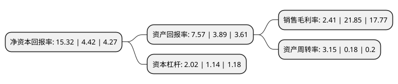

> 本页面由自动化程序生成于 2022年5月20日 01:18
> 内容可能存在错误，如有bug请提交issue至：https://github.com/Eroleice/doc-pi/issues
{.is-warning}

# 上市公司基本情况

## 基本资料

香农芯创科技股份有限公司（以下简称“香农芯创”）成立于1998年09月16日，宣城市。于2015年06月10日在深交所创业板上市。

香农芯创注册资本42,000万元，新型，高效节能洗衣机减速离合器研发，生产，销售以下是详细信息：

- 公司名称: 香农芯创科技股份有限公司
- 股票代码: 300475.SZ
- 所在地: 安徽 - 宣城市
- 成立日期: 1998年09月16日
- 注册资本: 42,000万元
- 法定代表人: 李小红
- 主营业务: 新型，高效节能洗衣机减速离合器研发，生产，销售
- 公司官网: www.shannonxsemi.com
- 公司介绍: 公司是一家专业从事新型、高效节能洗衣机减速离合器研发、生产、销售的高新技术企业，先后配套海尔、美的以及海信等洗衣机整机厂商，成功开发、推广了双驱动减速离合器、双波轮减速离合器、20公斤级波轮减速离合器、直驱电机减速离合器一体化装置等系列产品。依托强有力的技术创新、严格的质量控制得到了众多知名客户的高度认可，与海尔、美的、惠而浦等企业互为依托，共同致力于新型、高效节能、大容量洗衣机开发，形成稳固、紧密的合作关系。经过多年的发展，公司不断拓展高端市场，致力于为客户创造性能卓越的优质产品，已发展成为生产规模和技术实力优势明显的行业领军企业。

## 股东及高管情况

上市公司第一大股东为深圳市领信基石股权投资基金管理合伙企业(有限合伙)-深圳市领汇基石股权投资基金合伙企业(有限合伙)，持股49,676,067股，占比11.83%，**疑似为**上市公司实际控制人。

截至2022年04月30日，上市公司的前十大股东中，共有2名自然人股东，3名机构股东，5个产品账户，其中5%以上大股东共有7名。上市公司前十大股东明细如下：

> 未能通过持股比例判定出上市公司实际控制人（持股30%以上）
> 可能存在通过间接持股、联合持股、协议控制等方式拥有实际控制权的主体，具体请参考上市公司定期公告！
{.is-warning}

> 截至2022年04月30日，上市公司前十大股东信息如下：

| 股东名称 | 持股数量（股） | 持股比例 |
| --- | --- | --- |
| 深圳市领信基石股权投资基金管理合伙企业(有限合伙)-深圳市领汇基石股权投资基金合伙企业(有限合伙) | 49,676,067 | 11.83% |
| 刘翔 | 44,942,904 | 10.7% |
| 深圳市领信基石股权投资基金管理合伙企业(有限合伙)-深圳市领驰基石股权投资基金合伙企业(有限合伙) | 39,593,603 | 9.43% |
| 深圳市领信基石股权投资基金管理合伙企业(有限合伙)-深圳市领泰基石投资合伙企业(有限合伙) | 38,233,133 | 9.1% |
| 深圳市平石资产管理有限公司 | 24,780,000 | 5.9% |
| 珠海横琴长乐汇资本管理有限公司 | 24,780,000 | 5.9% |
| 芜湖弘唯基石投资基金管理合伙企业(有限合伙)-弘唯基石华盈私募投资基金 | 21,739,196 | 5.18% |
| 深圳市衍盛资产管理有限公司 | 21,000,000 | 5% |
| 刘军 | 11,965,253 | 2.85% |
| 上海呈瑞投资管理有限公司-呈瑞和兴41号私募证券投资基金 | 8,400,000 | 2% |

## 利润表分析

上市公司2021年总收入为92.05亿元，净利润为2.21亿元，实现盈利。

## 杜邦分析

> 数据列示周期：2021年 | 2020年 | 2019年
{.is-info}

上市公司的净资产收益率在近一年有所上升，上升幅度为246.61%，其变化情况分解如下：
- 上市公司的销售毛利率在近一年下降了-88.97%，可能是生产效率的下降、商品原材料价格上涨或商品价格的下跌所致。
- 上市公司的资产周转率在近一年上升了1650%，可能是源自于更快的销售回款或库存管理效果提升。
- 上市公司的财务杠杆比率在近一年上升了77.19%，可能是增加负债扩大生产规模。

