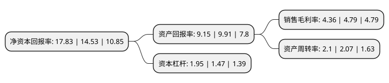

> 本页面由自动化程序生成于 2022年5月20日 01:22
> 内容可能存在错误，如有bug请提交issue至：https://github.com/Eroleice/doc-pi/issues
{.is-warning}

# 上市公司基本情况

## 基本资料

南京商络电子股份有限公司（以下简称“商络电子”）成立于1999年08月31日，南京市。于2021年04月21日在深交所创业板上市。

商络电子注册资本42,000万元，主要面向网络通信，消费电子，汽车电子，工业控制等应用领域的电子产品制造商，为其提供电子元器件产品。公司代理的产品包括电容，电感，电阻及射频器件等被动电子元器件及IC，分立器件，功率器件，存储器件及连接器等其他电子元器件，其中以被动电子元器件为主。以下是详细信息：

- 公司名称: 南京商络电子股份有限公司
- 股票代码: 300975.SZ
- 所在地: 江苏 - 南京市
- 成立日期: 1999年08月31日
- 注册资本: 42,000万元
- 法定代表人: 沙宏志
- 主营业务: 主要面向网络通信，消费电子，汽车电子，工业控制等应用领域的电子产品制造商，为其提供电子元器件产品公司代理的产品包括电容，电感，电阻及射频器件等被动电子元器件及IC，分立器件，功率器件，存储器件及连接器等其他电子元器件，其中以被动电子元器件为主
- 公司官网: www.jssunlord.com
- 公司介绍: 公司是国内领先的被动元器件授权分销商，主要面向网络通信、消费电子、汽车电子、工业控制等应用领域的电子产品制造商，为其提供电子元器件产品。公司代理的产品包括电容、电感、电阻及射频器件等被动电子元器件及IC、分立器件、功率器件、存储器件及连接器等其他电子元器件，其中以被动电子元器件为主。公司位于电子元器件产业链的中间环节，作为授权分销商，和电子元器件生产商及电子产品制造商基于供应链合作形成经济协同。公司以市场预测、客户需求预测、供应预测及客户订单为基础，集中议价和采购，并建立缓冲库存，以缩短行业交付周期、提升行业反应速度、降低行业成本，是电子元器件产业链中连接上下游的重要纽带。经过20余年的积累，公司已发展成为国内领先的被动电子元器件分销商。根据《国际电子商情》对中国电子元器件分销商的统计排名，公司位列“2018年中国电子元器件分销商排名TOP25”和“2018年被动元器件代理商前三甲”，在行业中具有较高的市场知名度。

## 股东及高管情况

上市公司第一大股东为沙宏志，持股167,878,480股，占比39.97%，为上市公司实际控制人。

截至2022年03月31日，上市公司的前十大股东中，共有4名自然人股东，6名机构股东，其中5%以上大股东共有3名。上市公司前十大股东明细如下：

> 截至2022年03月31日，上市公司前十大股东信息如下：

| 股东名称 | 持股数量（股） | 持股比例 |
| --- | --- | --- |
| 沙宏志 | 167,878,480 | 39.97% |
| 谢丽 | 42,672,000 | 10.16% |
| 张全 | 21,280,000 | 5.07% |
| 南京邦盛投资管理有限公司-苏州邦盛赢新创业投资企业(有限合伙) | 13,871,704 | 3.3% |
| 周加辉 | 13,104,000 | 3.12% |
| 苏州融联创业投资企业(有限合伙) | 10,500,000 | 2.5% |
| 南京昌络聚享企业管理咨询中心(有限合伙) | 8,984,640 | 2.14% |
| 西藏津盛泰达创业投资有限公司 | 8,750,000 | 2.08% |
| 乌鲁木齐海达阳明股权投资管理有限公司-杭州海达明德创业投资合伙企业(有限合伙) | 7,280,000 | 1.73% |
| 湖州泰宇投资合伙企业(有限合伙) | 7,151,469 | 1.7% |

## 利润表分析

上市公司2021年总收入为53.62亿元，净利润为2.33亿元，实现盈利。

## 杜邦分析

> 数据列示周期：2021年 | 2020年 | 2019年
{.is-info}

上市公司的净资产收益率在近一年有所上升，上升幅度为22.71%，其变化情况分解如下：
- 上市公司的销售毛利率在近一年下降了-8.98%，可能是生产效率的下降、商品原材料价格上涨或商品价格的下跌所致。
- 上市公司的资产周转率在近一年上升了1.45%，可能是源自于更快的销售回款或库存管理效果提升。
- 上市公司的财务杠杆比率在近一年上升了32.65%，可能是增加负债扩大生产规模。

