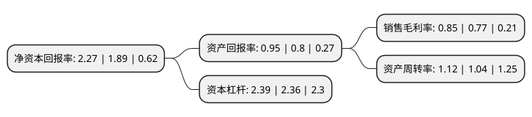

> 本页面由自动化程序生成于 2022年5月20日 01:24
> 内容可能存在错误，如有bug请提交issue至：https://github.com/Eroleice/doc-pi/issues
{.is-warning}

# 上市公司基本情况

## 基本资料

江苏弘业股份有限公司（以下简称“弘业股份”）成立于1994年06月30日，南京市。于1997年09月01日在上交所主板上市。

弘业股份注册资本24,676.75万元，主要产品:服装，玩具，帽类产品，手套，柳编制品，箱包，木雕。以下是详细信息：

- 公司名称: 江苏弘业股份有限公司
- 股票代码: 600128.SH
- 所在地: 江苏 - 南京市
- 成立日期: 1994年06月30日
- 注册资本: 24,676.75万元
- 法定代表人: 马宏伟
- 主营业务: 主要产品:服装，玩具，帽类产品，手套，柳编制品，箱包，木雕
- 公司官网: www.artall.com.cn
- 公司介绍: 公司是全国工艺品行业和江苏省外经贸系统第一家上市企业，现为江苏省苏豪控股集团有限公司重要成员企业。公司经营范围包括贸易、文化、投资三大主业。贸易板块主营机电、船舶、化肥、玩具、服装、渔具、鞋帽、服饰和家居用品等产品的出口业务，轨道交通设备、新型建筑材料、医疗器械、资源能源和精细化工等产品的进口业务及贵金属、服装家纺等产品的内贸业务。文化板块主营环境艺术工程、艺术品展陈与经营、文化产权交易等，江苏爱涛文化产业有限公司是文化板块的主要业务载体。投资板块主要包括长期股权投资、参与设立投资基金、参与IPO配售、参与二级市场定向增发等。公司先后通过了ISO9001质量管理体系、ISO14001环境管理体系和OHSAS18001职业健康安全管理体系认证，是“中国质量诚信企业”、“南京市总部企业”和“南京市外贸综合服务试点培育对象”，自主品牌“爱涛artall”连续多年荣获“江苏名牌产品”和“江苏省重点培育和发展的国际知名品牌”称号。

## 股东及高管情况

上市公司第一大股东为江苏省苏豪控股集团有限公司，持股54,820,061股，占比22.2153%，**疑似为**上市公司实际控制人。

截至2022年05月13日，上市公司的前十大股东中，共有5名自然人股东，4名机构股东，1个产品账户，其中5%以上大股东共有2名。上市公司前十大股东明细如下：

> 未能通过持股比例判定出上市公司实际控制人（持股30%以上）
> 可能存在通过间接持股、联合持股、协议控制等方式拥有实际控制权的主体，具体请参考上市公司定期公告！
{.is-warning}

> 截至2022年05月13日，上市公司前十大股东信息如下：

| 股东名称 | 持股数量（股） | 持股比例 |
| --- | --- | --- |
| 江苏省苏豪控股集团有限公司 | 54,820,061 | 22.2153% |
| 江苏省苏豪控股集团有限公司 | 54,320,061 | 22.01% |
| 爱涛文化集团有限公司 | 9,928,410 | 4.02% |
| 中国烟草总公司江苏省公司(江苏省烟草公司) | 3,122,311 | 1.27% |
| 刘文其 | 2,974,072 | 1.21% |
| 方杭平 | 2,878,400 | 1.17% |
| 中国建设银行股份有限公司-银河文体娱乐主题灵活配置混合型证券投资基金 | 2,200,000 | 0.89% |
| 余泳 | 1,770,000 | 0.72% |
| 方榕 | 1,526,000 | 0.62% |
| 杨燕芳 | 1,384,400 | 0.56% |

## 利润表分析

上市公司2021年总收入为53.21亿元，净利润为0.45亿元，实现盈利。

## 杜邦分析

> 数据列示周期：2021年 | 2020年 | 2019年
{.is-info}

上市公司的净资产收益率在近一年有所上升，上升幅度为20.11%，其变化情况分解如下：
- 上市公司的销售毛利率在近一年上升了10.39%，可能是生产效率的提升、商品原材料价格下跌或商品价格的上涨所致。
- 上市公司的资产周转率在近一年上升了7.69%，可能是源自于更快的销售回款或库存管理效果提升。
- 上市公司的财务杠杆比率在近一年上升了1.27%，可能是增加负债扩大生产规模。

