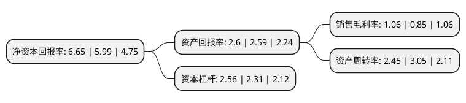

> 本页面由自动化程序生成于 2022年5月20日 01:25
> 内容可能存在错误，如有bug请提交issue至：https://github.com/Eroleice/doc-pi/issues
{.is-warning}

# 上市公司基本情况

## 基本资料

东方国际创业股份有限公司（以下简称“东方创业”）成立于1998年11月18日，上海市。于2000年07月12日在上交所主板上市。

东方创业注册资本88,352.743万元，主要业务:自营业务出口，加工补偿贸易，内销，货运及代理。以下是详细信息：

- 公司名称: 东方国际创业股份有限公司
- 股票代码: 600278.SH
- 所在地: 上海 - 上海市
- 成立日期: 1998年11月18日
- 注册资本: 88,352.743万元
- 法定代表人: 赵晓东
- 主营业务: 自营业务出口，加工补偿贸易，内销，货运及代理
- 公司官网: www.oie.com.cn
- 公司介绍: 公司系一家集货物贸易和现代物流为一体的，产业经营与资本运作相结合的综合型主板上市公司。公司作为一家老牌的国有进出口企业，拥有从国内外接单、各类面辅料采购、专业打样设计、自有工厂生产到全球物流配送等服装纺织品进出口的完整产业链。公司是中国最大的纺织服装出口商之一。公司在医疗器械、IT产品、电信产品和成套设备的国际采购招标和进口方面具有领先优势，多次承担重大项目的进口。在钢材、煤炭、木材、化工原料、羊毛和棉花等大宗原材料的进口方面具有经验丰富的业务团队和遍布全球的采购渠道。公司所属全资企业从事包括国际航运、国际船舶代理、国际货运代理、国际集装箱储运、国际快递、国际展览运输及报关、报检等在内的国际综合物流业务。公司目前是华安证券的第三大股东，还同时拥有一定数量的海通证券、农业银行、建设银行、招商银行等金融企业股票。公司在上海虹桥、苏河湾、虹口等商务区拥有一定规模的房地产。公司在国内多家银行等金融机构拥有良好的信用，具有较强的融资能力。

## 股东及高管情况

上市公司第一大股东为东方国际(集团)有限公司，持股428,561,101股，占比48.51%，为上市公司实际控制人。

截至2022年03月31日，上市公司的前十大股东中，共有3名自然人股东，7名机构股东，其中5%以上大股东共有2名。上市公司前十大股东明细如下：

> 截至2022年03月31日，上市公司前十大股东信息如下：

| 股东名称 | 持股数量（股） | 持股比例 |
| --- | --- | --- |
| 东方国际(集团)有限公司 | 428,561,101 | 48.51% |
| 上海纺织(集团)有限公司 | 90,297,015 | 10.22% |
| 苏州新区高新技术产业股份有限公司 | 41,095,890 | 4.65% |
| 上海上实(集团)有限公司 | 23,000,000 | 2.6% |
| 杨祖贵 | 14,213,109 | 1.61% |
| 江西大成资本管理有限公司 | 8,100,510 | 0.92% |
| 上海电气控股集团有限公司 | 6,843,960 | 0.77% |
| 义乌中国小商品城金融控股有限公司 | 6,226,650 | 0.7% |
| 陆洋 | 4,160,000 | 0.47% |
| 钟旭丹 | 3,974,100 | 0.45% |

## 杜邦分析

> 数据列示周期：2021年 | 2020年 | 2019年
{.is-info}

上市公司的净资产收益率在近一年有所上升，上升幅度为11.02%，其变化情况分解如下：
- 上市公司的销售毛利率在近一年上升了24.71%，可能是生产效率的提升、商品原材料价格下跌或商品价格的上涨所致。
- 上市公司的资产周转率在近一年下降了-19.67%，可能是源自于更慢的销售回款或库存管理效果下降。
- 上市公司的财务杠杆比率在近一年上升了10.82%，可能是增加负债扩大生产规模。

