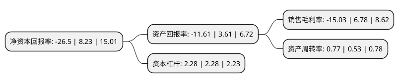

> 本页面由自动化程序生成于 2022年5月20日 01:25
> 内容可能存在错误，如有bug请提交issue至：https://github.com/Eroleice/doc-pi/issues
{.is-warning}

# 上市公司基本情况

## 基本资料

江苏舜天股份有限公司（以下简称“江苏舜天”）成立于1981年10月21日，南京市。于2000年09月01日在上交所主板上市。

江苏舜天注册资本44,328.277万元，主营业务为商品流通，服装加工，化工仓储及现代金融服务业投资。以下是详细信息：

- 公司名称: 江苏舜天股份有限公司
- 股票代码: 600287.SH
- 所在地: 江苏 - 南京市
- 成立日期: 1981年10月21日
- 注册资本: 44,328.277万元
- 法定代表人: 高松
- 主营业务: 主营业务为商品流通，服装加工，化工仓储及现代金融服务业投资
- 公司官网: www.saintycorp.com
- 公司介绍: 公司业务范围已拓展至进出口贸易、国内贸易、服装生产、化工仓储、股权投资等诸多领域，产品远销美国、欧盟、加拿大等近百个国家和地区。公司坚持品牌发展、诚信经营、守法经营，树立了良好的企业形象，积极实施以质取胜、技工贸一体化的发展战略，业务结构日益优化、经营实力不断提升、资产规模逐步壮大，核心竞争力不断增强。公司早于2003年通过了SGS的ISO9001质量管理体系认证，并先后获得“全国对外经贸企业管理现代化优秀奖”、“江苏省先进集体”、“全国外经贸质量效益型先进企业特别奖”、“江苏省文明单位标兵”、“江苏省五一劳动奖状”等荣誉称号。公司自主服装品牌“舜天/SAINTY”连续多年荣获国家商务部、省商务厅确定的“重点支持和发展的品牌出口商品”、“江苏省重点培育和发展的出口品牌”、“江苏省出口名牌”。

## 股东及高管情况

上市公司第一大股东为江苏舜天国际集团有限公司，持股218,278,355股，占比49.24%，为上市公司实际控制人。

截至2022年03月31日，上市公司的前十大股东中，共有6名自然人股东，4名机构股东，其中5%以上大股东共有1名。上市公司前十大股东明细如下：

> 截至2022年03月31日，上市公司前十大股东信息如下：

| 股东名称 | 持股数量（股） | 持股比例 |
| --- | --- | --- |
| 江苏舜天国际集团有限公司 | 218,278,355 | 49.24% |
| 尹修良 | 16,388,842 | 3.7% |
| 林川 | 5,054,397 | 1.14% |
| 陈子晖 | 2,738,900 | 0.62% |
| 福建乐祥投资有限公司 | 2,472,400 | 0.56% |
| 钟斌 | 2,426,000 | 0.55% |
| 范梅博 | 2,411,909 | 0.54% |
| 林旭曦 | 2,215,400 | 0.5% |
| 广东省丝绸纺织集团有限公司 | 2,205,772 | 0.5% |
| 福建融信达机械设备有限公司 | 2,032,582 | 0.46% |

## 利润表分析

上市公司2021年总收入为38.76亿元，净利润为-5.83亿元，**未实现盈利**。

## 杜邦分析

> 数据列示周期：2021年 | 2020年 | 2019年
{.is-info}

上市公司的净资产收益率在近一年有所下降，下降幅度为-421.99%，其变化情况分解如下：
- 上市公司的销售毛利率在近一年下降了-321.68%，可能是生产效率的下降、商品原材料价格上涨或商品价格的下跌所致。
- 上市公司的资产周转率在近一年上升了45.28%，可能是源自于更快的销售回款或库存管理效果提升。
- 上市公司的财务杠杆比率在近一年下降了0%，可能是减少负债降低财务费用。

