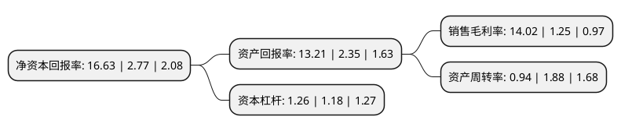

> 本页面由自动化程序生成于 2022年5月20日 01:25
> 内容可能存在错误，如有bug请提交issue至：https://github.com/Eroleice/doc-pi/issues
{.is-warning}

# 上市公司基本情况

## 基本资料

南宁化工股份有限公司（以下简称“*ST南化”）成立于1998年06月15日，南宁市。于2000年07月12日在上交所主板上市。

*ST南化注册资本23,514.814万元，主营业务:商品贸易以下是详细信息：

- 公司名称: 南宁化工股份有限公司
- 股票代码: 600301.SH
- 所在地: 广西 - 南宁市
- 成立日期: 1998年06月15日
- 注册资本: 23,514.814万元
- 法定代表人: 黄葆源
- 主营业务: 主营业务:商品贸易
- 公司官网: www.nh.com.cn
- 公司介绍: 公司原主要经营范围为：氯碱化学工业及其系列产品，农药、消毒剂、食品添加剂等无机和有机化工产品生产，工业用氧、工业用氮、溶解乙炔、液氯、液氨气体等压缩和液化气的生产。2015年，公司将涉及搬迁的资产转让给南化集团和公司将搬迁涉及土地收储合同(或协议)中约定的须由公司承担的义务(包括土地整理(包括拆迁、清场、环境治理)、土壤功能恢复等)转让给南化集团，尚未完成的整体搬迁工作，全部由南化集团承接完成，终止原有搬迁项目建设。目前，公司主要从事贸易业务。公司通过资源整合、产业研判、利用集团的平台优势等多样手段，构建了可有效复制扩张、整合大宗商品产业链上下游资源的经营模式，为客户提供优质的供应链服务。

## 股东及高管情况

上市公司第一大股东为南宁化工集团有限公司，持股75,248,058股，占比32%，为上市公司实际控制人。

截至2022年03月31日，上市公司的前十大股东中，共有7名自然人股东，3名机构股东，其中5%以上大股东共有1名。上市公司前十大股东明细如下：

> 截至2022年03月31日，上市公司前十大股东信息如下：

| 股东名称 | 持股数量（股） | 持股比例 |
| --- | --- | --- |
| 南宁化工集团有限公司 | 75,248,058 | 32% |
| 孙伟 | 5,000,000 | 2.13% |
| 魏巍 | 4,523,721 | 1.92% |
| 南宁产业投资集团有限责任公司 | 4,462,509 | 1.9% |
| 柴徐华 | 3,193,801 | 1.36% |
| 李亚洲 | 2,923,900 | 1.24% |
| 魏娟意 | 2,865,317 | 1.22% |
| 许静波 | 2,748,800 | 1.17% |
| 上海胤胜资产管理有限公司 | 2,570,900 | 1.09% |
| 陈林妹 | 2,133,500 | 0.91% |

## 利润表分析

上市公司2021年总收入为3.86亿元，净利润为0.54亿元，实现盈利。

## 杜邦分析

> 数据列示周期：2021年 | 2020年 | 2019年
{.is-info}

上市公司的净资产收益率在近一年有所上升，上升幅度为500.36%，其变化情况分解如下：
- 上市公司的销售毛利率在近一年上升了1021.6%，可能是生产效率的提升、商品原材料价格下跌或商品价格的上涨所致。
- 上市公司的资产周转率在近一年下降了-50%，可能是源自于更慢的销售回款或库存管理效果下降。
- 上市公司的财务杠杆比率在近一年上升了6.78%，可能是增加负债扩大生产规模。

