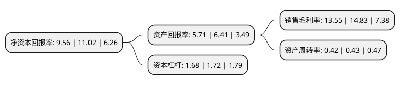

> 本页面由自动化程序生成于 2022年5月20日 01:28
> 内容可能存在错误，如有bug请提交issue至：https://github.com/Eroleice/doc-pi/issues
{.is-warning}

# 上市公司基本情况

## 基本资料

辽宁成大股份有限公司（以下简称“辽宁成大”）成立于1993年09月02日，大连市。于1996年08月19日在上交所主板上市。

辽宁成大注册资本152,970.982万元，医药医疗，金融投资，供应链服务(贸易)和能源开发以下是详细信息：

- 公司名称: 辽宁成大股份有限公司
- 股票代码: 600739.SH
- 所在地: 辽宁 - 大连市
- 成立日期: 1993年09月02日
- 注册资本: 152,970.982万元
- 法定代表人: 尚书志
- 主营业务: 医药医疗，金融投资，供应链服务(贸易)和能源开发
- 公司官网: www.chengda.com.cn
- 公司介绍: 公司业务分为医药医疗、金融投资、供应链服务(贸易)和能源开发四大业务板块。生物制药业务由子公司成大生物负责开展，专门从事人用疫苗的研发、生产和营销工作，上市品种有人用狂犬病疫苗、乙脑疫苗，在研品种主要有双价肾综合征出血热疫苗、A群C群脑膜炎球菌多糖结合疫苗、四价流感病毒裂解疫苗、b型流感嗜血杆菌结合疫苗、甲型肝炎灭活疫苗。医药流通业务由子公司成大方圆负责开展，从事药品连锁零售、医药批发和物流配送业务。医疗服务业务由子公司成大医疗负责开展。成大国际主要负责纺织品出口业务，主要面向日本、美国、欧洲市场，贯彻并坚持国际市场大客户合作战略；成大贸易和成大钢铁主要负责包括油品、煤炭、钢铁、木材、水产等大宗商品的内贸、进口及进、来料加工复出口业务，坚持专业化经营，努力成为供应链的组织者和管理者。“成大方圆”是全国医药服务行业第一个“中国驰名商标”。

## 股东及高管情况

上市公司第一大股东为韶关市高腾企业管理有限公司，持股234,004,700股，占比15.3%，**疑似为**上市公司实际控制人。

截至2022年05月09日，上市公司的前十大股东中，共有6名机构股东，4个产品账户，其中5%以上大股东共有3名。上市公司前十大股东明细如下：

> 未能通过持股比例判定出上市公司实际控制人（持股30%以上）
> 可能存在通过间接持股、联合持股、协议控制等方式拥有实际控制权的主体，具体请参考上市公司定期公告！
{.is-warning}

> 截至2022年05月09日，上市公司前十大股东信息如下：

| 股东名称 | 持股数量（股） | 持股比例 |
| --- | --- | --- |
| 韶关市高腾企业管理有限公司 | 234,004,700 | 15.3% |
| 辽宁省国有资产经营有限公司 | 169,889,039 | 11.11% |
| 广西鑫益信商务服务有限公司 | 130,323,119 | 8.52% |
| 吉林敖东药业集团股份有限公司 | 76,085,519 | 4.97% |
| 全国社保基金六零四组合 | 18,122,100 | 1.18% |
| 广西荣拓装饰工程有限责任公司 | 16,110,000 | 1.05% |
| 前海开源基金-民生银行-前海开源事件驱动集合资产管理计划 | 13,574,992 | 0.89% |
| 前海开源基金-民生银行-前海开源战略6号资产管理计划 | 11,034,583 | 0.72% |
| 方大炭素新材料科技股份有限公司 | 10,865,460 | 0.71% |
| 前海开源基金-建设银行-前海开源定增3号资产管理计划 | 8,887,511 | 0.58% |

## 利润表分析

上市公司2021年总收入为183.72亿元，净利润为24.88亿元，实现盈利。

## 杜邦分析

> 数据列示周期：2021年 | 2020年 | 2019年
{.is-info}

上市公司的净资产收益率在近一年有所下降，下降幅度为-13.25%，其变化情况分解如下：
- 上市公司的销售毛利率在近一年下降了-8.63%，可能是生产效率的下降、商品原材料价格上涨或商品价格的下跌所致。
- 上市公司的资产周转率在近一年下降了-2.33%，可能是源自于更慢的销售回款或库存管理效果下降。
- 上市公司的财务杠杆比率在近一年下降了-2.33%，可能是减少负债降低财务费用。

