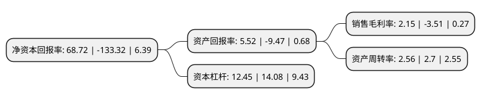

> 本页面由自动化程序生成于 2022年5月20日 01:28
> 内容可能存在错误，如有bug请提交issue至：https://github.com/Eroleice/doc-pi/issues
{.is-warning}

# 上市公司基本情况

## 基本资料

海航科技股份有限公司（以下简称“海航科技”）成立于1996年10月23日，天津市。于1996年09月09日在上交所主板上市。

海航科技注册资本289,933.778万元，IT产品分销及技术解决方案，移动设备及生命周期服务，电子商务供应链解决方案，海航云集市，海航云科技以下是详细信息：

- 公司名称: 海航科技股份有限公司
- 股票代码: 600751.SH
- 所在地: 天津 - 天津市
- 成立日期: 1996年10月23日
- 注册资本: 289,933.778万元
- 法定代表人: 朱勇
- 主营业务: IT产品分销及技术解决方案，移动设备及生命周期服务，电子商务供应链解决方案，海航云集市，海航云科技
- 公司官网: www.hna-tic.com
- 公司介绍: 公司原所处行业为海上运输，主营业务为国际近洋集装箱班轮运输、国内沿海集装箱班轮运输及船务代理和货运代理业务等。公司自2016年12月成功并购全球IT分销与供应链巨头英迈国际(Ingram Micro Inc.)，2017年开始逐步剥离海运业务，并成立海航云集市、海航云科技两大事业群，加速向信息技术和高新科技领域转型。公司服务于网络强国、数字强国、一带一路等国家战略，以人工智能、大数据和云计算为核心，致力于成为助力企业客户数字化转型、赋能行业经济、服务美好生活的数字赋能平台运营商。

## 股东及高管情况

上市公司第一大股东为海航科技集团有限公司，持股602,006,689股，占比20.76%，**疑似为**上市公司实际控制人。

截至2022年03月31日，上市公司的前十大股东中，共有6名自然人股东，3名机构股东，1个产品账户，其中5%以上大股东共有3名。上市公司前十大股东明细如下：

> 未能通过持股比例判定出上市公司实际控制人（持股30%以上）
> 可能存在通过间接持股、联合持股、协议控制等方式拥有实际控制权的主体，具体请参考上市公司定期公告！
{.is-warning}

> 截至2022年03月31日，上市公司前十大股东信息如下：

| 股东名称 | 持股数量（股） | 持股比例 |
| --- | --- | --- |
| 海航科技集团有限公司 | 602,006,689 | 20.76% |
| 国华人寿保险股份有限公司-万能三号 | 415,565,400 | 14.33% |
| 大新华物流控股(集团)有限公司 | 251,436,596 | 8.67% |
| 方正富邦基金-华夏银行-天海定增2号资产管理计划 | 20,080,805 | 0.69% |
| 张家玮 | 14,864,873 | 0.51% |
| 王雅萍 | 10,732,500 | 0.37% |
| 刘宏光 | 7,959,000 | 0.27% |
| 钱展望 | 6,188,800 | 0.21% |
| 周佳斌 | 4,624,200 | 0.16% |
| 张仟 | 4,538,300 | 0.16% |

## 利润表分析

上市公司2021年总收入为1,716.61亿元，净利润为36.97亿元，实现盈利。

## 杜邦分析

> 数据列示周期：2021年 | 2020年 | 2019年
{.is-info}

上市公司的净资产收益率在近一年有所下降，下降幅度为-151.55%，其变化情况分解如下：
- 上市公司的销售毛利率在近一年下降了-161.25%，可能是生产效率的下降、商品原材料价格上涨或商品价格的下跌所致。
- 上市公司的资产周转率在近一年下降了-5.19%，可能是源自于更慢的销售回款或库存管理效果下降。
- 上市公司的财务杠杆比率在近一年下降了-11.58%，可能是减少负债降低财务费用。

