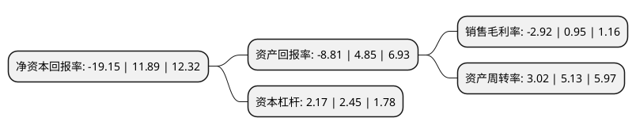

> 本页面由自动化程序生成于 2022年5月20日 01:28
> 内容可能存在错误，如有bug请提交issue至：https://github.com/Eroleice/doc-pi/issues
{.is-warning}

# 上市公司基本情况

## 基本资料

福建东方银星投资股份有限公司（以下简称“东方银星”）成立于1996年10月11日，福州市。于1996年09月27日在上交所主板上市。

东方银星注册资本23,030.718万元，大宗商品贸易业务主要以煤炭，焦炭等煤化工产品为主以下是详细信息：

- 公司名称: 福建东方银星投资股份有限公司
- 股票代码: 600753.SH
- 所在地: 福建 - 福州市
- 成立日期: 1996年10月11日
- 注册资本: 23,030.718万元
- 法定代表人: 梁衍锋
- 主营业务: 大宗商品贸易业务主要以煤炭，焦炭等煤化工产品为主
- 公司官网: www.orienstar.com
- 公司介绍: 公司由“冰熊股份”改制而来，1996年9月27日在上海证券交易所挂牌上市。目前公司围绕大宗商品贸易业务稳定持续经营，大宗商品贸易业务主要以煤炭、焦炭等煤化工产品为主，随着业务的不断扩张，未来将进一步扩充贸易品种，做大做实大宗商品贸易业务。公司先后成立上海星庚供应链管理有限公司、宁波星庚供应链管理有限公司，并借助控股股东资源优势展开焦炭及煤炭大宗商品贸易业务。公司控股股东中庚集团在地产领域拥有多年的项目开发及管理经验，积累了丰富的相关资源。

## 股东及高管情况

上市公司第一大股东为中庚置业集团有限公司，持股81,929,600股，占比35.57%，为上市公司实际控制人。

截至2022年03月31日，上市公司的前十大股东中，共有8名自然人股东，2名机构股东，其中5%以上大股东共有2名。上市公司前十大股东明细如下：

> 截至2022年03月31日，上市公司前十大股东信息如下：

| 股东名称 | 持股数量（股） | 持股比例 |
| --- | --- | --- |
| 中庚置业集团有限公司 | 81,929,600 | 35.57% |
| 上海杰宇资产管理有限公司 | 18,239,075 | 7.92% |
| 毛灿华 | 1,564,368 | 0.68% |
| 林殿海 | 1,427,192 | 0.62% |
| 沈建芳 | 1,250,060 | 0.54% |
| 孙东宏 | 1,068,260 | 0.46% |
| 林晞 | 996,000 | 0.43% |
| 黄振山 | 875,604 | 0.38% |
| 陈维恩 | 807,700 | 0.35% |
| 许若熙 | 788,100 | 0.34% |

## 利润表分析

上市公司2021年总收入为16.12亿元，净利润为-0.48亿元，**未实现盈利**。

## 杜邦分析

> 数据列示周期：2021年 | 2020年 | 2019年
{.is-info}

上市公司的净资产收益率在近一年有所下降，下降幅度为-261.06%，其变化情况分解如下：
- 上市公司的销售毛利率在近一年下降了-407.37%，可能是生产效率的下降、商品原材料价格上涨或商品价格的下跌所致。
- 上市公司的资产周转率在近一年下降了-41.13%，可能是源自于更慢的销售回款或库存管理效果下降。
- 上市公司的财务杠杆比率在近一年下降了-11.43%，可能是减少负债降低财务费用。

