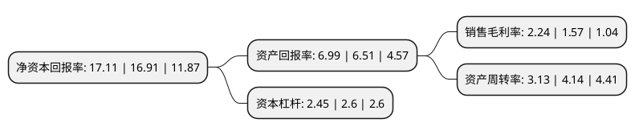

> 本页面由自动化程序生成于 2022年5月20日 01:29
> 内容可能存在错误，如有bug请提交issue至：https://github.com/Eroleice/doc-pi/issues
{.is-warning}

# 上市公司基本情况

## 基本资料

上海物资贸易股份有限公司（以下简称“上海物贸”）成立于1994年09月16日，上海市。于1994年02月04日在上交所主板上市。

上海物贸注册资本49,597.291万元，主营业务:汽车贸易，化工等生产资料的批发与零售，以及有色金属平台交易。以下是详细信息：

- 公司名称: 上海物资贸易股份有限公司
- 股票代码: 600822.SH
- 所在地: 上海 - 上海市
- 成立日期: 1994年09月16日
- 注册资本: 49,597.291万元
- 法定代表人: 秦青林
- 主营业务: 主营业务:汽车贸易，化工等生产资料的批发与零售，以及有色金属平台交易
- 公司官网: www.600822SH.com
- 公司介绍: 公司为全国最大的物贸中心，形成了现货、期货两大市场格局，成为上海市中山北路物贸一条街名副其实的龙头企业。目前，公司主要从事汽车贸易、化工等生产资料的批发与零售，以及有色金属平台交易。公司拥有上海有色金属交易中心、上海市旧机动车交易市场、上海危险化学品交易市场等多家专业市场，坚持培育365me工业品线上与线下和二手车交易平台。近几年，公司所属品牌4S店连续获得“上海大众六星级经销商”、“上海大众汽车斯柯达营销服务网络钻石级经销商”等荣誉称号。

## 股东及高管情况

上市公司第一大股东为百联集团有限公司，持股238,575,962股，占比48.1%，为上市公司实际控制人。

截至2022年03月31日，上市公司的前十大股东中，共有9名自然人股东，1名机构股东，其中5%以上大股东共有1名。上市公司前十大股东明细如下：

> 截至2022年03月31日，上市公司前十大股东信息如下：

| 股东名称 | 持股数量（股） | 持股比例 |
| --- | --- | --- |
| 百联集团有限公司 | 238,575,962 | 48.1% |
| 吴嘉毅 | 2,610,000 | 0.53% |
| 宋伟铭 | 2,270,000 | 0.46% |
| 颜翠英 | 1,980,930 | 0.4% |
| 施渊峰 | 1,728,500 | 0.35% |
| 包小虎 | 1,666,600 | 0.34% |
| 胡灵英 | 1,423,001 | 0.29% |
| 游俊 | 1,378,135 | 0.28% |
| 李春荣 | 1,179,800 | 0.24% |
| 胡亦飞 | 1,177,600 | 0.24% |

## 利润表分析

上市公司2021年总收入为65.66亿元，净利润为1.46亿元，实现盈利。

## 杜邦分析

> 数据列示周期：2021年 | 2020年 | 2019年
{.is-info}

上市公司的净资产收益率在近一年有所上升，上升幅度为1.18%，其变化情况分解如下：
- 上市公司的销售毛利率在近一年上升了42.68%，可能是生产效率的提升、商品原材料价格下跌或商品价格的上涨所致。
- 上市公司的资产周转率在近一年下降了-24.4%，可能是源自于更慢的销售回款或库存管理效果下降。
- 上市公司的财务杠杆比率在近一年下降了-5.77%，可能是减少负债降低财务费用。

