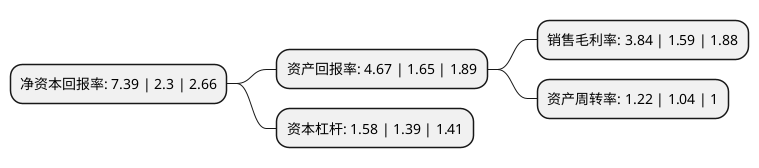

> 本页面由自动化程序生成于 2022年5月20日 01:36
> 内容可能存在错误，如有bug请提交issue至：https://github.com/Eroleice/doc-pi/issues
{.is-warning}

# 上市公司基本情况

## 基本资料

福建睿能科技股份有限公司（以下简称“睿能科技”）成立于2007年09月12日，福州市。于2017年07月06日在上交所主板上市。

睿能科技注册资本21,086.22万元，公司主要从事以针织横机电脑控制系统的研发，生产和销售为主的制造业务及以IC产品分销为主的分销业务。以下是详细信息：

- 公司名称: 福建睿能科技股份有限公司
- 股票代码: 603933.SH
- 所在地: 福建 - 福州市
- 成立日期: 2007年09月12日
- 注册资本: 21,086.22万元
- 法定代表人: 杨维坚
- 主营业务: 公司主要从事以针织横机电脑控制系统的研发，生产和销售为主的制造业务及以IC产品分销为主的分销业务
- 公司官网: www.raynen.cn
- 公司介绍: 公司是专业从事针纺电控、纺织伺服驱动器、智能照明电源的研发、生产及销售的高新技术企业。旗下子公司业务涉及针织行业应用软件研发、IC产品分销、工业电气自动化产品分销及系统集成等。公司自成立以来一直专注于针织横机电控系统的研发、生产和销售，通过多年的沉淀，形成了一批具有国内领先水平的核心技术，拥有多项国家专利和软件著作权。公司研发中心被认定为“中国纺织机械行业电脑横机智能控制系统产品研发中心”、“福建省纺织设备智能控制企业工程技术研究中心”和“福建省省级企业技术中心”，通过持续的自主研发和技术创新，公司横机电控产品性能、品质及良好的服务得到了客户的广泛认可，市场份额位居行业前列。公司始终坚持自主创新，为针织行业提供高品质、智能化的电控产品和先进的针织工艺软件、制版软件及横机联网管理等解决方案，推动传统针织行业的智能化进展，逐步实现从订单、设计到生产的柔性制造，进一步推动中国针织工业的转型升级。

## 股东及高管情况

上市公司第一大股东为睿能实业有限公司，持股135,394,736股，占比64.21%，为上市公司实际控制人。

截至2022年03月31日，上市公司的前十大股东中，共有8名自然人股东，2名机构股东，其中5%以上大股东共有2名。上市公司前十大股东明细如下：

> 截至2022年03月31日，上市公司前十大股东信息如下：

| 股东名称 | 持股数量（股） | 持股比例 |
| --- | --- | --- |
| 睿能实业有限公司 | 135,394,736 | 64.21% |
| 平潭捷润股权投资管理合伙企业(有限合伙) | 12,525,264 | 5.94% |
| 艾鹏飞 | 558,000 | 0.26% |
| 印长京 | 529,900 | 0.25% |
| 王永杰 | 477,400 | 0.23% |
| 陈晓彬 | 370,000 | 0.18% |
| 汪冬梅 | 340,000 | 0.16% |
| 陈昊 | 322,500 | 0.15% |
| 赵健民 | 300,000 | 0.14% |
| 张香玉 | 300,000 | 0.14% |

## 利润表分析

上市公司2021年总收入为20.85亿元，净利润为0.8亿元，实现盈利。

## 杜邦分析

> 数据列示周期：2021年 | 2020年 | 2019年
{.is-info}

上市公司的净资产收益率在近一年有所上升，上升幅度为221.3%，其变化情况分解如下：
- 上市公司的销售毛利率在近一年上升了141.51%，可能是生产效率的提升、商品原材料价格下跌或商品价格的上涨所致。
- 上市公司的资产周转率在近一年上升了17.31%，可能是源自于更快的销售回款或库存管理效果提升。
- 上市公司的财务杠杆比率在近一年上升了13.67%，可能是增加负债扩大生产规模。

