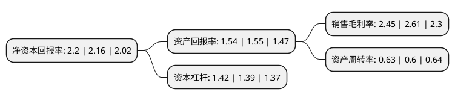

> 本页面由自动化程序生成于 2022年5月20日 01:03
> 内容可能存在错误，如有bug请提交issue至：https://github.com/Eroleice/doc-pi/issues
{.is-warning}

# 上市公司基本情况

## 基本资料

北京燕京啤酒股份有限公司（以下简称“燕京啤酒”）成立于1997年07月08日，北京市。于1997年07月16日在深交所主板上市。

燕京啤酒注册资本281,853.934万元，主营业务:生产和销售啤酒。以下是详细信息：

- 公司名称: 北京燕京啤酒股份有限公司
- 股票代码: 000729.SZ
- 所在地: 北京 - 北京市
- 成立日期: 1997年07月08日
- 注册资本: 281,853.934万元
- 法定代表人: 谢广军
- 主营业务: 主营业务:生产和销售啤酒
- 公司官网: www.yanjing.com.cn
- 公司介绍: 公司是中国最大啤酒企业集团之一。公司总部是亚洲最大的啤酒生产厂。连年被评为全国500家最佳经济效益工业企业、中国行业百强企业。高品质的燕京啤酒先后荣获“第31届布鲁塞尔国际金奖”，“首届全国轻工业博览会金奖”，“全国行业质量评比优质产品奖”，并获“全国啤酒质量检测A级产品”，“全国用户满意产品”,“中国名牌产品”等多项荣誉称号。燕京啤酒被指定为“人民大会堂国宴特供酒”、中国国际航空公司等四家航空公司配餐用酒,1997年燕京牌商标被国家工商总局认定为“驰名商标”，通过中国绿色食品发展中心审核，符合绿色食品A级标准。公司是国内首家北京2008年奥运会啤酒赞助商。

## 股东及高管情况

上市公司第一大股东为北京燕京啤酒投资有限公司，持股1,617,727,568股，占比57.4%，为上市公司实际控制人。

截至2022年03月31日，上市公司的前十大股东中，共有4名自然人股东，2名机构股东，3个产品账户，1个海外主体，其中5%以上大股东共有1名。上市公司前十大股东明细如下：

> 截至2022年03月31日，上市公司前十大股东信息如下：

| 股东名称 | 持股数量（股） | 持股比例 |
| --- | --- | --- |
| 北京燕京啤酒投资有限公司 | 1,617,727,568 | 57.4% |
| 香港中央结算有限公司(陆股通) | 110,637,583 | 3.93% |
| 北京燕京啤酒集团有限公司 | 52,686,697 | 1.87% |
| 唐建华 | 50,257,239 | 1.78% |
| 万中华 | 23,570,000 | 0.84% |
| 刘存 | 14,430,447 | 0.51% |
| 吴懿兵 | 14,145,542 | 0.5% |
| 中欧基金-农业银行-中欧中证金融资产管理计划 | 12,647,600 | 0.45% |
| 南方基金-农业银行-南方中证金融资产管理计划 | 12,647,600 | 0.45% |
| 工银瑞信基金-农业银行-工银瑞信中证金融资产管理计划 | 12,647,600 | 0.45% |

## 利润表分析

上市公司2021年总收入为119.6亿元，净利润为2.92亿元，实现盈利。

## 杜邦分析

> 数据列示周期：2021年 | 2020年 | 2019年
{.is-info}

上市公司的净资产收益率在近一年有所上升，上升幅度为1.85%，其变化情况分解如下：
- 上市公司的销售毛利率在近一年下降了-6.13%，可能是生产效率的下降、商品原材料价格上涨或商品价格的下跌所致。
- 上市公司的资产周转率在近一年上升了5%，可能是源自于更快的销售回款或库存管理效果提升。
- 上市公司的财务杠杆比率在近一年上升了2.16%，可能是增加负债扩大生产规模。

