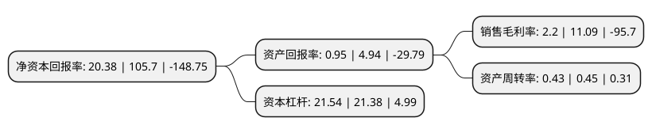

> 本页面由自动化程序生成于 2022年5月20日 01:03
> 内容可能存在错误，如有bug请提交issue至：https://github.com/Eroleice/doc-pi/issues
{.is-warning}

# 上市公司基本情况

## 基本资料

西藏发展股份有限公司（以下简称“*ST西发”）成立于1997年06月20日，拉萨市。于1997年06月25日在深交所主板上市。

*ST西发注册资本26,375.849万元，主要产品:啤酒。以下是详细信息：

- 公司名称: 西藏发展股份有限公司
- 股票代码: 000752.SZ
- 所在地: 西藏 - 拉萨市
- 成立日期: 1997年06月20日
- 注册资本: 26,375.849万元
- 法定代表人: 罗希
- 主营业务: 主要产品:啤酒
- 公司官网: irm.p5w.net/000752/index.html
- 公司介绍: 公司属食品、酒、烟草制造业，前身为拉萨啤酒厂，是自治区首家啤酒生产企业和区内骨干企业之一，主要从事啤酒生产销售业务，为自治区重点扶持企业。经营范围主要为：生产销售啤酒、饮料；饲料、养殖业；娱乐服务；藏红花系列产品开发；计算机软硬件系统集成产品，网络及信息技术产品的研制、开发、生产、销售。公司产品目前主要供应西藏市场，在西藏市场占有率较高。

## 股东及高管情况

上市公司第一大股东为西藏盛邦控股有限公司，持股33,613,192股，占比12.74%，**疑似为**上市公司实际控制人。

截至2022年03月31日，上市公司的前十大股东中，共有6名自然人股东，4名机构股东，其中5%以上大股东共有3名。上市公司前十大股东明细如下：

> 未能通过持股比例判定出上市公司实际控制人（持股30%以上）
> 可能存在通过间接持股、联合持股、协议控制等方式拥有实际控制权的主体，具体请参考上市公司定期公告！
{.is-warning}

> 截至2022年03月31日，上市公司前十大股东信息如下：

| 股东名称 | 持股数量（股） | 持股比例 |
| --- | --- | --- |
| 西藏盛邦控股有限公司 | 33,613,192 | 12.74% |
| 西藏天易隆兴投资有限公司 | 28,099,562 | 10.65% |
| 西藏国有资本投资运营有限公司 | 19,242,842 | 7.3% |
| 西藏简智创业投资合伙企业(有限合伙) | 13,000,063 | 4.93% |
| 黄建山 | 3,783,600 | 1.43% |
| 吴刚 | 3,551,730 | 1.35% |
| 黄彪 | 3,338,803 | 1.27% |
| 张利 | 2,293,700 | 0.87% |
| 刘选云 | 2,022,500 | 0.77% |
| 李馨 | 2,000,000 | 0.76% |

## 利润表分析

上市公司2021年总收入为3.92亿元，净利润为0.08亿元，实现盈利。

## 杜邦分析

> 数据列示周期：2021年 | 2020年 | 2019年
{.is-info}

上市公司的净资产收益率在近一年有所下降，下降幅度为-80.72%，其变化情况分解如下：
- 上市公司的销售毛利率在近一年下降了-80.16%，可能是生产效率的下降、商品原材料价格上涨或商品价格的下跌所致。
- 上市公司的资产周转率在近一年下降了-4.44%，可能是源自于更慢的销售回款或库存管理效果下降。
- 上市公司的财务杠杆比率在近一年上升了0.75%，可能是增加负债扩大生产规模。

