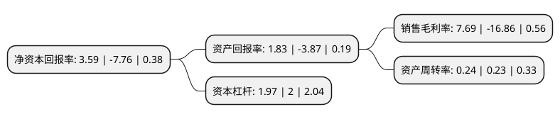

> 本页面由自动化程序生成于 2022年5月20日 01:04
> 内容可能存在错误，如有bug请提交issue至：https://github.com/Eroleice/doc-pi/issues
{.is-warning}

# 上市公司基本情况

## 基本资料

兰州黄河企业股份有限公司（以下简称“兰州黄河”）成立于1996年12月31日，兰州市。于1999年06月23日在深交所主板上市。

兰州黄河注册资本18,576.6万元，主要产品:啤酒，麦芽，饮料。以下是详细信息：

- 公司名称: 兰州黄河企业股份有限公司
- 股票代码: 000929.SZ
- 所在地: 甘肃 - 兰州市
- 成立日期: 1996年12月31日
- 注册资本: 18,576.6万元
- 法定代表人: 杨世江
- 主营业务: 主要产品:啤酒，麦芽，饮料
- 公司官网: www.yellowriver.net.cn
- 公司介绍: 公司成立于1993年12月，是甘肃省最早设立的股份制企业之一，同时也是目前兰州市属企业唯一一家国内A股上市公司。公司的主营业务为啤酒、麦芽、饮料的生产、加工与销售，主要产品是“黄河”、“青海湖”系列啤酒和“黄河”麦芽等，经营模式为从原料采购到麦芽生产和啤酒酿造再到产成品销售。公司依托较强的新品研发能力，凭借中国驰名商标“黄河”系列产品和新近推出的“青海湖”品牌系列新品以及良好的产品质量，在西北，特别是甘肃、青海、宁夏三省啤酒市场占据一定的的市场份额。

## 股东及高管情况

上市公司第一大股东为兰州黄河新盛投资有限公司，持股39,931,229股，占比21.5%，**疑似为**上市公司实际控制人。

截至2022年03月31日，上市公司的前十大股东中，共有3名自然人股东，6名机构股东，1个产品账户，其中5%以上大股东共有1名。上市公司前十大股东明细如下：

> 未能通过持股比例判定出上市公司实际控制人（持股30%以上）
> 可能存在通过间接持股、联合持股、协议控制等方式拥有实际控制权的主体，具体请参考上市公司定期公告！
{.is-warning}

> 截至2022年03月31日，上市公司前十大股东信息如下：

| 股东名称 | 持股数量（股） | 持股比例 |
| --- | --- | --- |
| 兰州黄河新盛投资有限公司 | 39,931,229 | 21.5% |
| 湖南昱成投资有限公司 | 9,288,300 | 5% |
| 宁琛 | 7,214,400 | 3.88% |
| 甘肃省工业交通投资有限公司 | 5,495,947 | 2.96% |
| 兰州富润房地产开发有限公司 | 3,398,588 | 1.83% |
| 张奕 | 2,013,009 | 1.08% |
| 深圳顺合盛国际投资有限公司 | 1,468,010 | 0.79% |
| 中国建设银行股份有限公司-鹏华中证酒交易型开放式指数证券投资基金 | 1,192,500 | 0.64% |
| 甘肃新盛工贸有限公司 | 1,013,600 | 0.55% |
| 任娜嘉 | 945,100 | 0.51% |

## 利润表分析

上市公司2021年总收入为3.08亿元，净利润为0.23亿元，实现盈利。

## 杜邦分析

> 数据列示周期：2021年 | 2020年 | 2019年
{.is-info}

上市公司的净资产收益率在近一年有所下降，下降幅度为-146.26%，其变化情况分解如下：
- 上市公司的销售毛利率在近一年下降了-145.61%，可能是生产效率的下降、商品原材料价格上涨或商品价格的下跌所致。
- 上市公司的资产周转率在近一年上升了4.35%，可能是源自于更快的销售回款或库存管理效果提升。
- 上市公司的财务杠杆比率在近一年下降了-1.5%，可能是减少负债降低财务费用。

