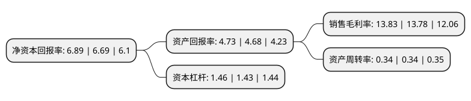

> 本页面由自动化程序生成于 2022年5月20日 01:09
> 内容可能存在错误，如有bug请提交issue至：https://github.com/Eroleice/doc-pi/issues
{.is-warning}

# 上市公司基本情况

## 基本资料

广州珠江啤酒股份有限公司（以下简称“珠江啤酒”）成立于2002年12月25日，广州市。于2010年08月18日在深交所中小板上市。

珠江啤酒注册资本221,332.848万元，主营业务为啤酒的生产与销售。主要产品为珠江品牌系列啤酒。以下是详细信息：

- 公司名称: 广州珠江啤酒股份有限公司
- 股票代码: 002461.SZ
- 所在地: 广东 - 广州市
- 成立日期: 2002年12月25日
- 注册资本: 221,332.848万元
- 法定代表人: 王志斌
- 主营业务: 主营业务为啤酒的生产与销售主要产品为珠江品牌系列啤酒
- 公司官网: www.zhujiangbeer.com
- 公司介绍: 公司是一家以啤酒业为主体，以啤酒配套和相关产业为辅助的大型现代化啤酒企业，全球单厂最大的啤酒酿造中心。珠江啤酒是全国三大啤酒品牌之一，单一品牌销量位居全国同行第二，在中国啤酒行业中享有“南有珠江”的美誉。采用低温膜过滤技术和无菌包装技术生产瓶装纯生啤酒等先进技术，填补了国内空白。珠江啤酒系列、雪堡啤酒系列产品质量优越，深受消费者欢迎，珠江啤酒勇夺中国驰名商标，蝉联中国名牌产品、绿色食品和中国酒类质量优级证书等荣誉称号。

## 股东及高管情况

上市公司第一大股东为广州产业投资控股集团有限公司，持股1,198,493,234股，占比54.15%，为上市公司实际控制人。

截至2022年03月31日，上市公司的前十大股东中，共有1名自然人股东，1名机构股东，6个产品账户，2个海外主体，其中5%以上大股东共有2名。上市公司前十大股东明细如下：

> 截至2022年03月31日，上市公司前十大股东信息如下：

| 股东名称 | 持股数量（股） | 持股比例 |
| --- | --- | --- |
| 广州产业投资控股集团有限公司 | 1,198,493,234 | 54.15% |
| INTERBREW INVESTMENT INTERNATIONAL HOLDING LIMITED | 663,777,210 | 29.99% |
| 中国建设银行股份有限公司-富国价值创造混合型证券投资基金 | 12,224,672 | 0.55% |
| 香港中央结算有限公司(陆股通) | 8,102,066 | 0.37% |
| 交通银行股份有限公司-富国消费主题混合型证券投资基金 | 4,914,615 | 0.22% |
| 中国工商银行股份有限公司-富国品质生活混合型证券投资基金 | 4,318,797 | 0.2% |
| 黄建山 | 3,963,900 | 0.18% |
| 中国建设银行股份有限公司-鹏华中证酒交易型开放式指数证券投资基金 | 3,426,886 | 0.15% |
| 中国工商银行股份有限公司-富国消费精选30股票型证券投资基金 | 3,115,482 | 0.14% |
| 招商银行股份有限公司-鹏扬汇利债券型证券投资基金 | 3,004,987 | 0.14% |

## 利润表分析

上市公司2021年总收入为45.37亿元，净利润为6.27亿元，实现盈利。

## 杜邦分析

> 数据列示周期：2021年 | 2020年 | 2019年
{.is-info}

上市公司的净资产收益率在近一年有所上升，上升幅度为2.99%，其变化情况分解如下：
- 上市公司的销售毛利率在近一年上升了0.36%，可能是生产效率的提升、商品原材料价格下跌或商品价格的上涨所致。
- 上市公司的资产周转率在近一年下降了0%，可能是源自于更慢的销售回款或库存管理效果下降。
- 上市公司的财务杠杆比率在近一年上升了2.1%，可能是增加负债扩大生产规模。

