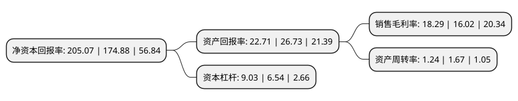

> 本页面由自动化程序生成于 2022年5月20日 01:24
> 内容可能存在错误，如有bug请提交issue至：https://github.com/Eroleice/doc-pi/issues
{.is-warning}

# 上市公司基本情况

## 基本资料

重庆啤酒股份有限公司（以下简称“重庆啤酒”）成立于1993年12月20日，重庆市。于1997年10月30日在上交所主板上市。

重庆啤酒注册资本48,397.12万元，主要产品:啤酒。以下是详细信息：

- 公司名称: 重庆啤酒股份有限公司
- 股票代码: 600132.SH
- 所在地: 重庆 - 重庆市
- 成立日期: 1993年12月20日
- 注册资本: 48,397.12万元
- 法定代表人: Leo Evers
- 主营业务: 主要产品:啤酒
- 公司官网: www.chongqingbeer.com
- 公司介绍: 公司前身为重庆啤酒厂，创建于1958年，始终致力于品牌文化建设，将品牌内涵与城市文化相融合，成为重庆一张重要的城市名片。经过60年的市场竞争，公司由建厂之初的60万资产，发展为拥有资产近35亿元，年销售啤酒近100万千升的西南领先啤酒企业，“中国十大啤酒集团”之一，连续二十年进入“重庆工业五十强”。1997年成为上市公司后，重啤股份发展更加迅猛，在立足重庆本土的基础上，通过兼并、合资、参股、资产重组等现代资本运作的方式，不断扩张。目前，重啤股份有15个生产基地，分布于重庆、四川、湖南等地。重啤股份也始终致力于引进国际资本、先进技术和管理经验，在中国啤酒企业中率先与世界啤酒巨头展开合作。2013年，全球第三大啤酒商、丹麦嘉士伯集团经过多年的增持，以60%的持股比例成为重啤股份第一大股东，重啤股份由此正式成为嘉士伯集团成员。

## 股东及高管情况

上市公司第一大股东为嘉士伯啤酒厂香港有限公司，持股205,882,718股，占比42.54%，为上市公司实际控制人。

截至2022年03月31日，上市公司的前十大股东中，共有2名机构股东，5个产品账户，2个海外主体，1名其他股东，其中5%以上大股东共有3名。上市公司前十大股东明细如下：

> 截至2022年03月31日，上市公司前十大股东信息如下：

| 股东名称 | 持股数量（股） | 持股比例 |
| --- | --- | --- |
| 嘉士伯啤酒厂香港有限公司 | 205,882,718 | 42.54% |
| CARLSBERG CHONGQING LIMITED | 84,500,000 | 17.46% |
| 香港中央结算有限公司(陆股通) | 46,477,090 | 9.6% |
| 中国建设银行股份有限公司-银华富裕主题混合型证券投资基金 | 13,107,352 | 2.71% |
| 中国建设银行股份有限公司-汇添富消费行业混合型证券投资基金 | 5,000,000 | 1.03% |
| 兴业银行股份有限公司-工银瑞信文体产业股票型证券投资基金 | 2,580,969 | 0.53% |
| 中信证券股份有限公司 | 2,537,589 | 0.52% |
| 澳门金融管理局-自有资金 | 2,290,499 | 0.47% |
| 招商银行股份有限公司-泓德睿泽混合型证券投资基金 | 2,052,877 | 0.42% |
| 中国工商银行股份有限公司-汇添富消费精选两年持有期股票型证券投资基金 | 2,000,000 | 0.41% |

## 利润表分析

上市公司2021年总收入为131.19亿元，净利润为23.99亿元，实现盈利。

## 杜邦分析

> 数据列示周期：2021年 | 2020年 | 2019年
{.is-info}

上市公司的净资产收益率在近一年有所上升，上升幅度为17.26%，其变化情况分解如下：
- 上市公司的销售毛利率在近一年上升了14.17%，可能是生产效率的提升、商品原材料价格下跌或商品价格的上涨所致。
- 上市公司的资产周转率在近一年下降了-25.75%，可能是源自于更慢的销售回款或库存管理效果下降。
- 上市公司的财务杠杆比率在近一年上升了38.07%，可能是增加负债扩大生产规模。

