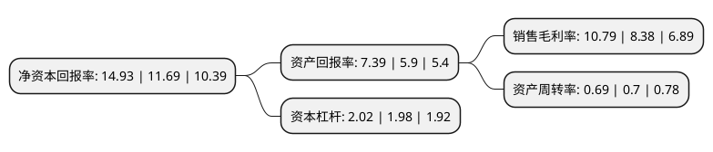

> 本页面由自动化程序生成于 2022年5月20日 01:27
> 内容可能存在错误，如有bug请提交issue至：https://github.com/Eroleice/doc-pi/issues
{.is-warning}

# 上市公司基本情况

## 基本资料

青岛啤酒股份有限公司（以下简称“青岛啤酒”）成立于1995年12月27日，青岛市。于1993年08月27日在上交所主板上市。

青岛啤酒注册资本136,435.479万元，主要产品:啤酒。以下是详细信息：

- 公司名称: 青岛啤酒股份有限公司
- 股票代码: 600600.SH
- 所在地: 山东 - 青岛市
- 成立日期: 1995年12月27日
- 注册资本: 136,435.479万元
- 法定代表人: 黄克兴
- 主营业务: 主要产品:啤酒
- 公司官网: www.tsingtao.com.cn
- 公司介绍: 公司经营范围是啤酒制造、销售以及与之相关的业务。目前公司在国内拥有62家全资和控股的啤酒生产企业，及2家联营及合营啤酒生产企业，分布于全国20个省、直辖市、自治区，规模和市场份额居国内啤酒行业领先地位。其生产的青岛啤酒为国际市场上最具知名度的中国品牌，已行销世界100个国家和地区。目前，青岛啤酒远销美国、加拿大、英国、法国、德国、意大利、澳大利亚、韩国、日本、丹麦、俄罗斯等世界90多个国家和区域。全球啤酒行业权威报告Barth Report依据产量排名，青岛啤酒为世界第五大啤酒厂商。

## 股东及高管情况

上市公司第一大股东为香港中央结算(代理人)有限公司，持股613,927,619股，占比45%，为上市公司实际控制人。

截至2022年03月31日，上市公司的前十大股东中，共有2名机构股东，6个产品账户，2个海外主体，其中5%以上大股东共有2名。上市公司前十大股东明细如下：

> 截至2022年03月31日，上市公司前十大股东信息如下：

| 股东名称 | 持股数量（股） | 持股比例 |
| --- | --- | --- |
| 香港中央结算(代理人)有限公司 | 613,927,619 | 45% |
| 青岛啤酒集团有限公司 | 443,467,655 | 32.5% |
| 香港中央结算有限公司(陆股通) | 18,842,860 | 1.38% |
| 中国证券金融股份有限公司 | 16,015,045 | 1.17% |
| 兴业银行股份有限公司-工银瑞信文体产业股票型证券投资基金 | 6,373,899 | 0.47% |
| 中国工商银行股份有限公司-东方红启恒三年持有期混合型证券投资基金 | 5,609,103 | 0.41% |
| 中国工商银行股份有限公司-富国天惠精选成长混合型证券投资基金(LOF) | 5,000,000 | 0.37% |
| 中国农业银行股份有限公司-易方达消费行业股票型证券投资基金 | 4,934,900 | 0.36% |
| 交通银行股份有限公司-富国消费主题混合型证券投资基金 | 4,736,119 | 0.35% |
| 中国建设银行股份有限公司-富国价值创造混合型证券投资基金 | 4,511,686 | 0.33% |

## 利润表分析

上市公司2021年总收入为301.66亿元，净利润为32.56亿元，实现盈利。

## 杜邦分析

> 数据列示周期：2021年 | 2020年 | 2019年
{.is-info}

上市公司的净资产收益率在近一年有所上升，上升幅度为27.72%，其变化情况分解如下：
- 上市公司的销售毛利率在近一年上升了28.76%，可能是生产效率的提升、商品原材料价格下跌或商品价格的上涨所致。
- 上市公司的资产周转率在近一年下降了-1.43%，可能是源自于更慢的销售回款或库存管理效果下降。
- 上市公司的财务杠杆比率在近一年上升了2.02%，可能是增加负债扩大生产规模。

