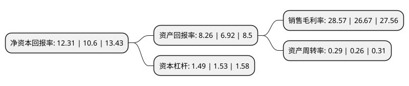

> 本页面由自动化程序生成于 2022年5月20日 01:23
> 内容可能存在错误，如有bug请提交issue至：https://github.com/Eroleice/doc-pi/issues
{.is-warning}

# 上市公司基本情况

## 基本资料

中国国际贸易中心股份有限公司（以下简称“中国国贸”）成立于1997年10月15日，北京市。于1999年03月12日在上交所主板上市。

中国国贸注册资本100,728.253万元，主要业务:高档甲级写字楼，高档涉外公寓，商场等设施的出租及管理，大型展览及配套服务，停车设施服务。以下是详细信息：

- 公司名称: 中国国际贸易中心股份有限公司
- 股票代码: 600007.SH
- 所在地: 北京 - 北京市
- 成立日期: 1997年10月15日
- 注册资本: 100,728.253万元
- 法定代表人: 林明志
- 主营业务: 高档甲级写字楼，高档涉外公寓，商场等设施的出租及管理，大型展览及配套服务，停车设施服务
- 公司官网: www.cwtc.com
- 公司介绍: 公司是经国务院批准成立的，是中国乃至全球规模最大、功能最齐全的综合性高档商务服务大型中外合资企业。公司主要从事商务服务设施的投资、经营和管理，包括高档甲级写字楼、商城、公寓等设施的出租及管理，高档酒店经营，大型展览及配套服务，停车设施服务等。公司云集了多家国际知名跨国公司、商社和国际顶级零售店，并承接多项国际、国内重大会议及大型商务活动，接待了许多国家的国家元首、政府首脑、重要国际组织负责人以及国内外商界领导人和社会知名人士等，取得了良好的经济效益和社会效益。经过二十多年的发展，中国国贸已成为国际一流水准的现代化商务中心，是展示中国对外开放政策和从事国际交流活动的重要窗口。以中国国贸为中心的CBD地区，已经形成了一个极具活力的经济商圈，辐射带动了周边经济的快速发展。

## 股东及高管情况

上市公司第一大股东为中国国际贸易中心有限公司，持股812,360,241股，占比80.65%，为上市公司实际控制人。

截至2022年03月31日，上市公司的前十大股东中，共有6名自然人股东，1名机构股东，2个产品账户，1个海外主体，其中5%以上大股东共有1名。上市公司前十大股东明细如下：

> 截至2022年03月31日，上市公司前十大股东信息如下：

| 股东名称 | 持股数量（股） | 持股比例 |
| --- | --- | --- |
| 中国国际贸易中心有限公司 | 812,360,241 | 80.65% |
| 香港中央结算有限公司(陆股通) | 12,303,010 | 1.22% |
| 易方达基金管理有限公司-社保基金1104组合 | 10,450,052 | 1.04% |
| 顾青 | 6,695,100 | 0.66% |
| 吴宝珍 | 5,768,300 | 0.57% |
| 易方达基金-农业银行-中国太平洋人寿股票相对收益型产品(保额分红)委托投资 | 5,653,966 | 0.56% |
| 吴悦 | 5,008,400 | 0.5% |
| 朱金妹 | 4,801,000 | 0.48% |
| 解荣军 | 4,792,400 | 0.48% |
| 徐鹏达 | 4,790,610 | 0.48% |

## 利润表分析

上市公司2021年总收入为35.85亿元，净利润为10.24亿元，实现盈利。

## 杜邦分析

> 数据列示周期：2021年 | 2020年 | 2019年
{.is-info}

上市公司的净资产收益率在近一年有所上升，上升幅度为16.13%，其变化情况分解如下：
- 上市公司的销售毛利率在近一年上升了7.12%，可能是生产效率的提升、商品原材料价格下跌或商品价格的上涨所致。
- 上市公司的资产周转率在近一年上升了11.54%，可能是源自于更快的销售回款或库存管理效果提升。
- 上市公司的财务杠杆比率在近一年下降了-2.61%，可能是减少负债降低财务费用。

